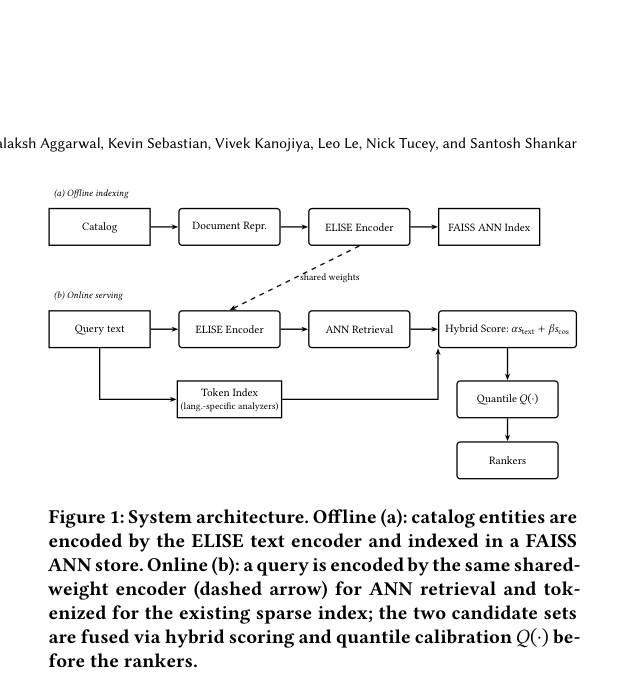

# ELISE：Apple Music 多语言语义检索

> **Fidelity: 核心机制复现**。本地代码执行论文最有辨识度、可由公开数据验证的机制；私有数据、生产模型与服务栈明确列为边界。

## 论文信息

| 项目 | 内容 |
| --- | --- |
| 论文链接 | [arXiv 2607.10239](https://arxiv.org/abs/2607.10239) |
| 公司/机构 | Apple（按第一作者所属机构聚合） |
| 首次公开日期 | 2026-07-11（arXiv v1） |
| 原文开源代码 | 否：论文未提供官方/作者代码（核查日期：2026-09-02） |
| Adapter | `elise` |
| 本地复现代码 | [`src/auto_research/reproductions/elise/`](https://github.com/daiwk/auto-research/tree/main/src/auto_research/reproductions/elise/) |

## 原始论文总结

### 背景与主要改动

Siamese bi-encoder 补充词法倒排，再用分位数分布匹配把 dense 与 token score 校准到同一尺度并限制语义结果数量。


<!-- paper-figure:start -->
### 原论文关键图

[](https://arxiv.org/pdf/2607.10239#page=2)

> **原论文 Figure 1（关键图）**：展示原论文提出的核心架构、主要模块及其连接关系。图片来自[原论文](https://arxiv.org/abs/2607.10239)，版权归原作者所有；点击图片可查看来源。
<!-- paper-figure:end -->

### 核心公式

$$
s_{hybrid}=\\alpha F_d(s_d)+(1-\\alpha)F_l(s_l).
$$

### 论文离线与线上效果

- Apple Music 全球 18 天实验，全球 18 天 A/B：转化率 +2.28%、无结果率 -86.0%，tail query 转化 +7.93%。
- 上述数字只复述论文线上证据，不写入本地公开数据效果结论。

## 本地复现

> **本地对照口径**：同一全目录协议下，基线 NDCG@10 为 `0.05401`，实验组 ELISE 为 `0.04739`，相对变化 **-12.24%**。这是公开代理任务的负结果，生产线上 lift 的外推不适用。

三随机种子完整结果、均值、标准差与 95% CI：

- [`metrics/public-seeds42-44.json`](metrics/public-seeds42-44.json)

```bash
auto-research reproduce --paper elise --dataset-dir data --seed 42
```

## 复现边界

本地使用 MovieLens-1M 的公开子集及可审计代理目标，不能复现论文公司的私有日志、线上分桶、生产模型规模和 serving 栈。因此本页只解释为核心机制级验证，不宣称复现原文绝对指标或线上增益。
