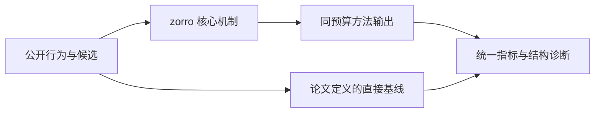
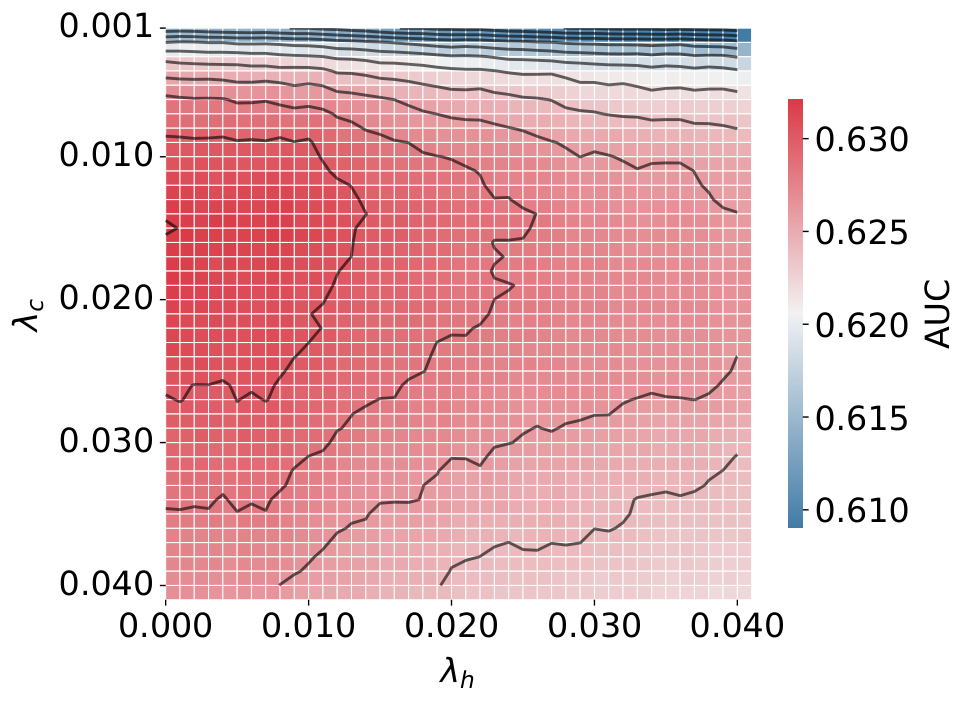

# ZoRRO：零训练参数的个性化新闻推荐

> **Fidelity: 核心机制复现**。本地代码执行论文最有辨识度、可由公开数据验证的机制；私有数据、生产模型与服务栈明确列为边界。

## 论文信息

| 项目 | 内容 |
| --- | --- |
| 论文链接 | [arXiv 2607.10910](https://arxiv.org/abs/2607.10910) |
| 公司/机构 | Technical University of Denmark（按第一作者所属机构聚合） |
| 首次公开日期 | 2026-07-12（arXiv v1） |
| 原文开源代码 | 是：[johanneskruse/zorro](https://github.com/johanneskruse/zorro) |
| Adapter | `zorro` |
| 本地复现代码 | [`src/auto_research/reproductions/zorro/`](https://github.com/daiwk/auto-research/tree/main/src/auto_research/reproductions/zorro/) |

## 原始论文总结

### 背景与主要改动

不用模型训练，直接融合历史文章的时间衰减、语义相似度和类别关系，面向高吞吐新闻候选排序。



<!-- paper-figure:start -->
### 原论文关键图

[](https://arxiv.org/html/2607.10910v1/heatmap_lambda.png)

> **原论文 Figure 2（关键图）**：展示原论文方法的总体设计和关键组成。图片来自[原论文](https://arxiv.org/abs/2607.10910)，版权归原作者所有；点击图片可查看来源。
<!-- paper-figure:end -->

### 核心公式

$$
s(i|H)=\\lambda_h\\sum_{j\\in H}w_j\\cos(e_j,e_i)+\\lambda_c\\sum_{j\\in H}w_j\\mathbf1[c_j=c_i].
$$

### 论文离线与线上效果

- Ekstra Bladet 六天在线实验，CTR 4.19%，接近 NRMS 4.33%，高于热门基线 2.96%；六天真实流量实验。
- 上述数字只复述论文线上证据，不写入本地公开数据效果结论。

## 本地复现

> **本地对照口径**：同一全目录协议下，基线 NDCG@10 为 `0.05401`，实验组 ZoRRO 为 `0.05201`，相对变化 **-3.70%**。这是公开代理任务的负结果，生产线上 lift 的外推不适用。

三随机种子完整结果、均值、标准差与 95% CI：

- [`metrics/public-seeds42-44.json`](metrics/public-seeds42-44.json)

```bash
auto-research reproduce --paper zorro --dataset-dir data --seed 42
```

## 复现边界

本地使用 MovieLens-1M 的公开子集及可审计代理目标，不能复现论文公司的私有日志、线上分桶、生产模型规模和 serving 栈。因此本页只解释为核心机制级验证，不宣称复现原文绝对指标或线上增益。
