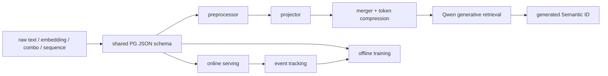

# Prompt Generation：配置驱动的生成式检索特征框架

> **Fidelity: 核心机制复现**。本地实际执行论文同款 Qwen2.5-0.5B、MiniOneRec Amazon Office 数据与官方三段式 SID、双 JSON 单一事实源、text/embedding/combo/sequence 四类特征、preprocessor/projector/merger 组件协议、embedding-space mean merger、LoRA SFT、validation 配置选择和 held-out 候选评分。未复刻淘宝全量训练、C++ batched kernels、线上 event replay 和生产 serving。

## 论文信息

| 项目 | 内容 |
| --- | --- |
| 论文链接 | [arXiv 2607.11326](https://arxiv.org/abs/2607.11326) |
| 公司/机构 | Alibaba / Taobao Search |
| 首次公开日期 | 2026-07-13（arXiv v1） |
| 原文开源代码 | 否：论文未提供官方/作者代码（核查日期：2026-07-15） |
| Adapter | `prompt-generation` |
| 本地复现代码 | [`src/auto_research/reproductions/prompt_generation/`](https://github.com/daiwk/auto-research/tree/main/src/auto_research/reproductions/prompt_generation/) |

## 原始论文总结

### 背景与主要改动

生成式检索把 query、用户行为和异构特征输入 LLM，再直接生成商品或文档 SID。工业系统的问题不只是模型效果：每次加特征都要同步修改数据、训练和 serving，容易产生 training-serving skew；长文本和行为序列又会迅速放大 token 数与延迟。

PG 用 `prompt_template.json` 与 `prompt_feature.json` 把特征工程从模型代码中解耦。协议固定四类特征（text、embedding、combo、sequence）和三类正交组件（preprocessor、projector、merger）；训练与 serving 解释同一份配置。Merger 同时承担信息融合和 token 压缩，论文发现 parameter-free mean pooling 是很强的默认值。线上源特征通过 event tracking 回流，离线可重放真实 serving 输入。



### 核心公式

把第 $i$ 个原始特征 $x_i$ 依次经过预处理 $P_i$、投影 $R_i$ 和融合/压缩 $M_i$，再按模板 $mathcal{T}$ 组装为模型输入：

$$
Z_i=M_i\left(R_i\left(P_i(x_i)\right)\right),\qquad X_{PG}=\mathcal{T}(Z_1,\ldots,Z_n).
$$

参数为零的 mean merger 将一段 $m$ 个 token embedding 压成一个 token：

$$
z_{mean}=\frac{1}{m}\sum_{j=1}^{m}e_j.
$$

LLM 对目标 SID token 序列 $s_{1:L}$ 做标准自回归 SFT：

$$
\mathcal{L}_{NTP}=-\sum_{t=1}^{L}\log p_\theta(s_t\mid X_{PG},s_{<t}).
$$

同一配置解释器同时用于训练和 serving，并用线上原始特征重放检查一致性；工程目标可写作 $PG_{train}(x,c)=PG_{serve}(x,c)$。

### 论文离线与线上效果

论文在 Taobao Search、Taobao Recommendation、S1-tiny、RecIF 和 Amazon Industrial/Office 五个场景验证。Amazon Office 使用 Qwen2.5-Instruct-0.5B 和 3-token SID：

| Office configuration | HR@1 | HR@5 | HR@10 | HR@20 | HR@50 |
|---|---:|---:|---:|---:|---:|
| SID only | 7.52 | 11.27 | 12.99 | 14.66 | 18.81 |
| + Title | **8.06** | 11.16 | 12.70 | 14.73 | 18.25 |
| + Title + Brand | 7.93 | 11.39 | 12.86 | **15.18** | 18.93 |
| + merger(Title) + merger(Brand) | 7.60 | **11.47** | 12.88 | 14.95 | **19.37** |

这张表也是论文的重要结论：不存在所有 K 都最优的固定特征配方，盲目增加文本可能退化，PG 的价值是低成本、安全地搜索配置。

| Production A/B | Traffic / duration | Paper result |
|---|---|---:|
| Taobao Search | 1% / 14 days | transaction +0.47%，GMV +0.51% |
| Taobao Recommendation Newdetail | 2% / 12 days | IPV +0.66%，PVR +7.93% |
| Shop Search | 10% / >2 weeks | transaction +4.01% |

论文还报告 PG 训练侧耗时从 176.2ms 降到 19.8ms（-88.8%），端到端吞吐从 1.32 升到 1.83 iter/s（+38.6%）；内部 autoresearch 仅修改配置，20 轮后 HR@20 +3.05%。

## 本地复现

> **本地对照口径**：基线是相同 Qwen2.5-0.5B、相同步数和候选集下的 `SID only`；实验组只通过 JSON 配置加入原始 Title 或 embedding-space mean-compressed Title+Brand；validation 选择 `SID+Title`，其 test sampled HR@10 相对基线 **-11.11%**。这是 PG 特征配置消融，不是相对 DIN，也不是论文线上 A/B。

本地直接使用论文公开实验引用的 MiniOneRec Office 文件，包括 3,459 个商品、三段式 SID、标题、品牌、描述和 Qwen 商品向量。三组实验从同一 Qwen checkpoint 初始化，使用相同 LoRA rank、优化步数、随机种子、用户和 50-item sampled catalog；只允许 validation HR@10/HR@5 选择配置，test 不参与选择。

```bash
GIT_LFS_SKIP_SMUDGE=1 git clone --depth 1 \
  https://huggingface.co/kkknight/MiniOneRec data/minionerec-public
git -C data/minionerec-public lfs pull \
  --include='Amazon/train/Office_Products_5_2016-10-2018-11.csv,Amazon/valid/Office_Products_5_2016-10-2018-11.csv,Amazon/test/Office_Products_5_2016-10-2018-11.csv,Amazon/index/Office_Products.*'

AUTO_RESEARCH_PG_MODEL=Qwen/Qwen2.5-0.5B-Instruct \
AUTO_RESEARCH_PG_STEPS=20 \
AUTO_RESEARCH_PG_TRAIN_ROWS=4000 \
AUTO_RESEARCH_PG_EVAL_USERS=12 \
AUTO_RESEARCH_PG_CANDIDATES=20 \
auto-research reproduce --paper prompt-generation --seed 42
```

| Local configuration | Mean prompt tokens | Loss first 5 → last 5 | Test HR@1 | HR@5 | HR@10 | Test scoring time |
|---|---:|---:|---:|---:|---:|---:|
| SID only（基线） | 61.1 | 2.6339 → 1.7992 | 0.4167 | 0.4167 | **0.7500** | 14.45s |
| SID + Title（validation 选中） | 128.7 | 2.9980 → 2.3921 | 0.3333 | 0.4167 | 0.6667 | 154.92s |
| SID + mean(Title) + mean(Brand) | 67.0 | 2.6500 → 1.9926 | 0.4167 | 0.4167 | 0.5000 | 14.90s |

validation 上 SID-only 与 Title 的 HR@10 同为 0.8333，Title 以 HR@5 0.6667 对 0.5833 胜出，因此按预先声明规则选择 Title；它在 test HR@10 上却从 0.7500 降到 0.6667（**-11.11%**），没有复现论文的全量训练收益。压缩配置也没有改善准确率，但相对原始 Title 将 prompt token 减少 **47.94%**、本地 test 打分时间减少 **90.38%**，且只比 SID-only 慢约 3.15%。这支持 PG 的效率机制和“更多文本不保证更好”的论文观察，但不支持本地小预算下的效果提升。

本轮只训练 4,000 条可采样数据、20 steps，并在固定 20-item sampled catalog 的 12 validation / 12 test 用户上比较；论文则在 36,586 条训练数据和完整目录上报告 HR。所有三组都从同一 checkpoint 重新初始化，20-step loss 均下降；模型未保存到 Git。

稳定结果见 [`metrics/office-qwen05b-seed42.json`](metrics/office-qwen05b-seed42.json)。数据、模型 checkpoint 和原始 `runs/` 不提交 Git；扩大到论文 36,586 条全量训练时只需增加环境变量，不改模型与配置协议。
