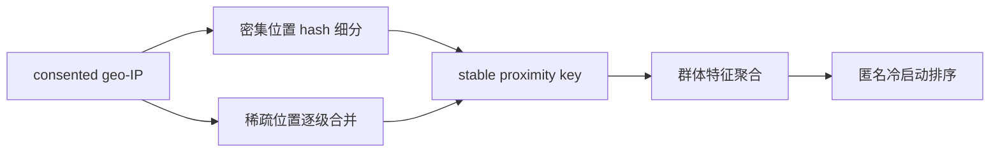

# Proximity Features：隐私合规的冷启动群体特征

> **Fidelity: 核心机制复现**。dense hash refinement、sparse fine-to-coarse clustering、稳定 proximity key、群体聚合与冷启动 scoring 均实际执行。

## 论文信息

| 项目 | 内容 |
| --- | --- |
| 论文链接 | [arXiv 2607.12246](https://arxiv.org/abs/2607.12246) |
| 公司/机构 | Airbnb |
| 首次公开日期 | 2026-07-14（arXiv v1） |
| 原文开源代码 | 否：论文未提供官方/作者代码（核查日期：2026-07-22） |
| Adapter | `proximity-features` |
| 本地复现代码 | [`src/auto_research/reproductions/proximity_features/`](https://github.com/daiwk/auto-research/tree/main/src/auto_research/reproductions/proximity_features/) |

## 原始论文总结

### 背景与主要改动

匿名用户没有 user ID。Airbnb 把 consented geo-IP population-center 坐标聚成约 1,000 用户的 proximity key：密集位置用 IP hash 细分，稀疏位置逐级降低地理精度合并；群体行为按稳定 key 每日聚合，线上无需持久个人标识。



### 核心公式

$$
key=base64(\lfloor lat\,s\rfloor,\lfloor lng\,s\rfloor,h(ip)\bmod b),
$$

$$
\max |\mathcal P|\quad\text{s.t.}\quad\sum_{i\in B_j}n_i\ge T,\ \forall B_j.
$$

### 论文离线与线上效果

营销页全球 booking `+0.011%`、first-time bookers `+2.0%`；AutoSuggest 全球 booking `+0.16%`、first-time booking `+0.33%`。

## 本地复现

> **本地对照口径**：基线是 global cold-start aggregate；实验组用 MovieLens ZIP 的 adaptive proximity aggregate，验证集选择 blend `1.0`，相对基线 Hit@10 **`+16.67%`**、NDCG@10 **`+22.91%`**。

932 个 ZIP 用户形成 99 个 bucket，中位数 10；全量原始物品特征下群体信号优于 global aggregate。稳定指标见 [`metrics/movielens-100k-seed42.json`](metrics/movielens-100k-seed42.json)。

```bash
auto-research reproduce --paper proximity-features --seed 42
```

## 复现边界

ZIP prefix 不是 geo-IP 坐标；阈值缩为 12，只验证算法，不构成论文约 1,000 用户的隐私保证。
