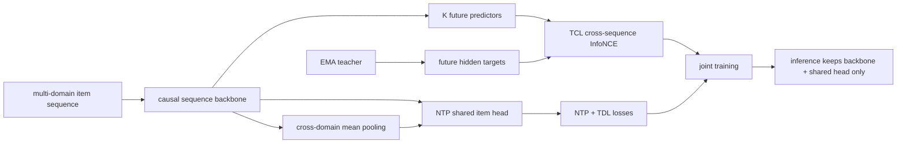

# NONTP：突破生成式推荐 NTP 的时空局部性

> **Fidelity: 核心机制复现**。本地真实执行 NTP、EMA teacher、三个未来步 predictor、跨序列 InfoNCE、跨域 hidden-state pooling 与共享预测头；训练辅助分支在推理时全部移除。

## 论文信息

| 项目 | 内容 |
| --- | --- |
| 论文链接 | [arXiv 2607.12277](https://arxiv.org/abs/2607.12277) |
| 公司/机构 | Meituan |
| 首次公开日期 | 2026-07-14（arXiv v1） |
| 原文开源代码 | 否：论文未提供官方/作者代码（核查日期：2026-07-22） |
| Adapter | `nontp` |
| 本地复现代码 | [`src/auto_research/reproductions/nontp/`](https://github.com/daiwk/auto-research/tree/main/src/auto_research/reproductions/nontp/) |

## 原始论文总结

### 背景与主要改动

标准 next-token prediction 只要求当前位置预测紧邻的下一个物品：它既没有监督 hidden state 理解更远的未来轨迹，也没有让跨业务上下文直接更新稀疏域目标物品。NONTP 将前者称为 temporal locality，后者称为 spatial locality。

TCL 用在线 backbone 的第 $j$ 个状态预测 EMA teacher 的第 $j+k$ 个未来状态，并只把其他用户序列作为负例；TDL 收集目标之前、且与目标不同域的 hidden states，均值池化后通过 NTP 的同一个 item head 预测目标。两个辅助模块只在训练时存在，因此线上结构、参数量和延迟与 NTP 相同。



### 核心公式

总目标使用论文默认权重：

$$
\mathcal L=\mathcal L_{NTP}+0.1\mathcal L_{TCL}+0.1\mathcal L_{TDL}.
$$

EMA teacher 更新为：

$$
\theta_{ema}\leftarrow 0.999\theta_{ema}+0.001\theta_{online}.
$$

对未来偏移 $k$，TCL 将 $g_k(h_j)$ 对齐到 teacher 状态 $h_{j+k}^{ema}$：

$$
\mathcal L_{TCL}=-\frac{1}{K}\sum_{k=1}^{K}\log
\frac{\exp(\operatorname{sim}(g_k(h_j),h_{j+k}^{ema})/\tau)}
{\sum_{s'\ne s,j'}\exp(\operatorname{sim}(g_k(h_j),h_{j'+k}^{ema,s'})/\tau)}.
$$

TDL 使用目标域之外的历史状态：

$$
z_j^{tdl}=\frac{1}{|C_j|}\sum_{l\in C_j}h_l,\qquad
C_j=\{l<j:d_l\ne d_{j+1}\},
$$

$$
\mathcal L_{TDL}=-\log\operatorname{softmax}(z_j^{tdl}E^T)_{i_{j+1}}.
$$

### 论文离线与线上效果

Amazon Movie-Book-CDs 的 999 候选实验中，NTP 的 HR@10/NDCG@10 为 `0.3455/0.2371`，NONTP 为 `0.3553/0.2459`，分别相对提升 `2.8%/3.7%`。美团工业全库实验中，All HR@10 从 NTP `0.0361` 提升到 NONTP `0.0485`。

线上在美团 DSP 召回层运行 14 天，control 与 treatment 各 5% 流量：CTR `+1.8%`、GMV `+2.1%`，均为 p<0.01。

## 本地复现

> **本地对照口径**：基线是相同 causal backbone、相同初始化和训练预算的 `ntp`；实验组是同时加入 TCL 与 TDL 的 `nontp`。三随机种子下 Hit@10 从 `0.05079` 降到 `0.04828`（**-4.93%**），NDCG@10 从 `0.02431` 降到 `0.02222`（**-8.62%**）。这是 MovieLens genre-domain 对照，不是论文 Amazon 或线上 A/B。

MovieLens-100K 的时间序列代替原论文 3.2M 商品 Amazon 三域数据；每个电影的 primary genre 作为公开 domain label。四组 `ntp/tcl/tdl/nontp` 使用相同 leave-two-out、全物品排序和 seeds 42/43/44。

| Variant | Hit@10 | NDCG@10 | Head share@10 |
|---|---:|---:|---:|
| NTP | **0.05079 ± 0.00268** | **0.02431 ± 0.00062** | 0.99961 |
| NTP + TCL | 0.05043 ± 0.00382 | 0.02304 ± 0.00205 | 0.99979 |
| NTP + TDL | 0.04828 ± 0.00175 | 0.02354 ± 0.00109 | 0.99971 |
| NONTP | 0.04828 ± 0.00488 | 0.02222 ± 0.00270 | 0.99982 |

三个辅助组都没有在这个短序列、弱域标签协议上超过 NTP；所有模型的 head share 接近 1，说明紧凑全库训练仍严重偏向热门物品。该负结果与论文对“Amazon 平均长度 12 时增益明显小于工业平均长度 280”的分析一致，但不能据此断言 NONTP 在原数据上无效。

```bash
AUTO_RESEARCH_NONTP_STEPS=80 \
AUTO_RESEARCH_NONTP_SEEDS=3 \
auto-research reproduce --paper nontp --seed 42
```

稳定指标见 [`metrics/movielens-100k-seeds42-44.json`](metrics/movielens-100k-seeds42-44.json)。checkpoint 与原始 runs 不提交。

## 复现边界

- 保留论文 $K=3$、$m=0.999$、$\tau=0.07$ 和两个辅助损失权重 `0.1`。
- TCL 的同序列位置被明确排除出负例；TDL 使用目标之前且不同域的位置，不泄漏目标内容。
- HSTU 被紧凑 causal Transformer 替代；Amazon Movie/Book/CDs 和美团私有业务标签被 MovieLens genre 替代，因此属于核心机制复现。
- 推理只调用 backbone 与共享 item head，实际没有执行 teacher、predictor 或 TDL pooling。
