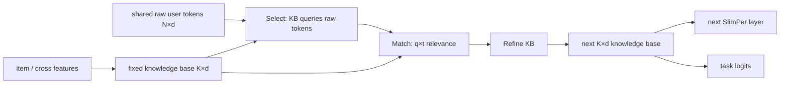

# SlimPer：固定知识库的长序列个性化排序

> **Fidelity: 核心机制复现**。实际训练逐层 Select–Match–Refine、固定容量 knowledge base 和 request-only user-token 共享；缩小历史长度与模态。

## 论文信息

| 项目 | 内容 |
| --- | --- |
| 论文链接 | [arXiv 2607.12281](https://arxiv.org/abs/2607.12281) |
| 公司/机构 | Meta Platforms, Inc. |
| 首次公开日期 | 2026-07-14（arXiv v1） |
| 原文开源代码 | 否：论文未提供官方/作者代码（核查日期：2026-07-22） |
| Adapter | `slimper` |
| 本地复现代码 | [`src/auto_research/reproductions/slimper/`](https://github.com/daiwk/auto-research/tree/main/src/auto_research/reproductions/slimper/) |

## 原始论文总结

### 背景与主要改动

生成式 Transformer 需要保留每个 token 的中间状态，但推荐排序最终只输出少量 user-item relevance 分数。SlimPer 用固定 `K×d` knowledge base 替代逐层 `N×d` 历史状态；每层重新访问原始 sparse/sequence tokens，先 Select 相关证据，再与 knowledge templates 做显式 Match，最后 Refine knowledge base。user-side token 每个 request 只编码一份并由所有候选共享。



### 核心公式

$$
Q=\mathcal L(X^k),\qquad
R=\operatorname{Softmax}(Q E^\top/\sqrt d)E,qquad
T=\mathcal L(X^k).
$$

$$
\lambda_e=RT^\top,\qquad
X^{k+1}=X^k+\operatorname{MLP}_\mu\!\left([\operatorname{RMSNorm}(\lambda_e),\mathcal L(X^k),D]\right).
$$

逐层计算为 $O(KN)$/固定中间状态 $O(LK)$，而 full-sequence attention 为 $O(N^2)$/$O(LN)$。

### 论文离线与线上效果

Reels 2k events：reshare NE `-0.51%`、QPS `+11.0%`、memory `-9.32%`；Feed 1k events memory `-18.12%`。论文报告实际 FLOPs 减少 `8×–25×`。SlimPer 已在 Instagram Reels/Feed 全流量发布，多个 engagement 指标统计显著提升、生态 guardrail 无回退、GPU capacity 近似中性；原文未披露具体线上 lift，只称 aggregate topline impact 约为典型显著 launch 的 `10×`。本项目按用户明确认可，将这种 full-traffic 证据作为硬门槛例外。

## 本地复现

> **本地对照口径**：基线是参数匹配的 6-layer full-sequence Transformer（138,337 参数）；实验组是 3-layer SlimPer（145,027 参数），NDCG@10 相对 **`+1.29%`**。

MovieLens-100K 固定 220 users / 360 items、32-event 历史、同训练样本/optimizer/120 steps。SlimPer Hit@10 `+14.29%`、attention-score elements `-94.12%`、逐层中间状态 elements `-87.88%`；full-catalog 推理的 user tokens 每个请求只编码一次。稳定指标见 [`metrics/movielens-100k-seed42.json`](metrics/movielens-100k-seed42.json)。

```bash
auto-research reproduce --paper slimper --seed 42
```

## 复现边界

MovieLens item/genre/sequence 替代 Instagram sparse+dense+multimodal features，32 events 替代 1k–10k+ events，AdamW 替代 Shampoo；没有复刻生产 kernel、多任务头和真实 QPS，只报告解析 attention/intermediate elements。
