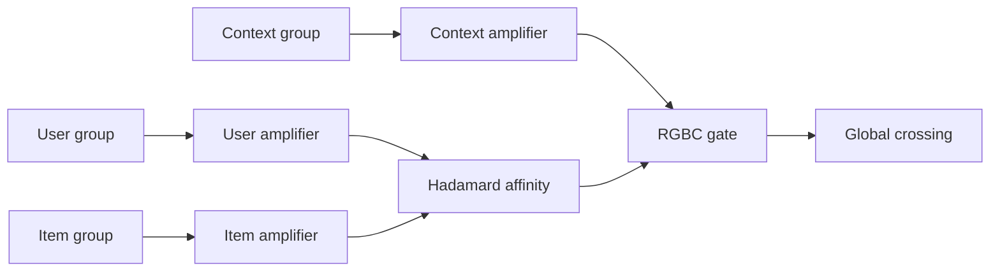

# MESH：异构内容解耦的可扩展召回

> **Fidelity: 核心机制复现**。分组 manifold、独立 residual signal amplifier、全局 crossing 与 RGBC 均实际执行。

## 论文信息

| 项目 | 内容 |
| --- | --- |
| 论文链接 | [arXiv 2607.12392](https://arxiv.org/abs/2607.12392) |
| 公司/机构 | Pinterest |
| 首次公开日期 | 2026-07-14（arXiv v1） |
| 原文开源代码 | 否：论文未提供官方/作者代码（核查日期：2026-07-22） |
| Adapter | `mesh` |
| 本地复现代码 | [`src/auto_research/reproductions/mesh/`](https://github.com/daiwk/auto-research/tree/main/src/auto_research/reproductions/mesh/) |

## 原始论文总结

### 背景与主要改动

统一放大 flat retrieval 容易让高频 evergreen 梯度淹没 fresh/tail 信号。MESH 先把 user/item/context 分到独立 sub-tower，各自在全局交互前用 residual crossing 放大；RGBC 再用 context gate 调节纯 user-item affinity，服务端可并行各塔并异步缓存 item tower。



### 核心公式

$$
H_k^l=\operatorname{Norm}(H_k^{l-1}+\Phi(H_k^{l-1},H_k^{l-1})),\qquad H_0=\operatorname{LN}(\sigma(MLP(T_c))\odot(T_u\odot T_i)+T_c).
$$

### 论文离线与线上效果

Pinterest：fresh-item repins `+5.5%`、funnel efficiency `+55%`、retention `+0.46%`；系统吞吐 `2.87×`。

## 本地复现

> **本地对照口径**：基线是 flat retrieval；实验组 MESH 使用三塔放大与 RGBC，验证集选 blend `0.1`，相对基线 Hit@10 `+0.00%`、NDCG@10 **`-3.54%`**。

本地 Python 小批量测试不具备论文的 TorchScript/GPU 并行条件，测得 `0.33×`，只作为反例记录。稳定指标见 [`metrics/movielens-100k-seed42.json`](metrics/movielens-100k-seed42.json)。

```bash
auto-research reproduce --paper mesh --seed 42
```

## 复现边界

未复刻 DHEN 全算子与生产 GPU inter-op；不引用本地微基准支持论文吞吐结论。
