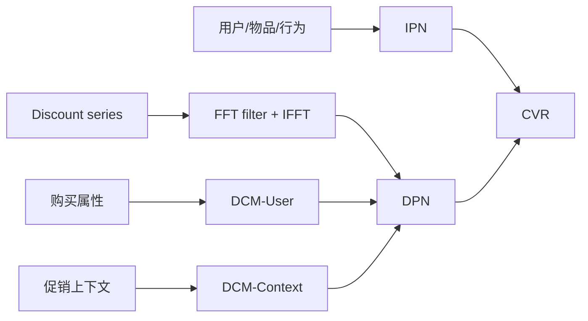

# DANet：折扣感知的转化率预测

> **Fidelity: 核心机制复现**。参照作者开源代码执行 IPN、FFT/IFFT、DCM-User、DCM-Context 与折扣回归辅助任务。

## 论文信息

| 项目 | 内容 |
| --- | --- |
| 论文链接 | [arXiv 2607.12578](https://arxiv.org/abs/2607.12578) |
| 公司/机构 | Alibaba Group / Tmall |
| 首次公开日期 | 2026-07-14（arXiv v1） |
| 原文开源代码 | 是：[tangrc/DANet](https://github.com/tangrc/DANet) |
| Adapter | `danet` |
| 本地复现代码 | [`src/auto_research/reproductions/danet/`](https://github.com/daiwk/auto-research/tree/main/src/auto_research/reproductions/danet/) |

## 原始论文总结

### 背景与主要改动

只建模兴趣无法解释“便宜多少”对购买的影响。DANet 的 IPN 捕获一般兴趣；DPN 对 400 天 discount-rate 序列做 FFT 滤波和高低频分解，DCM-User 从相似购买中抽取折扣偏好，DCM-Context 用促销周期 gate 修正分布，并以购买样本的真实折扣做辅助回归。



### 核心公式

$$
Z=FFT(S^d),\quad S_l^d=IFFT(f_t(Z)),\quad S_h^d=S^d-S_l^d,
$$

$$
\mathcal L=\mathcal L_{CE}+\alpha\mathbf 1[y=1]\operatorname{MSE}(y_d,\hat y_d).
$$

### 论文离线与线上效果

Tmall 线上 pCVR `+3.63%`、GMV `+2.23%`；折扣商品 PVR `7.56→11.14`（`+47.32%`）。

## 本地复现

> **本地对照口径**：基线是 IPN interest score；实验组 DANet 加入折扣代理的 TFTM/DCM，Hit@10 `+0.00%`、NDCG@10 **`-1.46%`**，fresh Hit@10 **`+50.00%`**。

MovieLens 无价格，周期性 popularity/rating intensity 仅代理 discount series，所以主排序结果不能解释为 CVR。稳定指标见 [`metrics/movielens-100k-seed42.json`](metrics/movielens-100k-seed42.json)。

```bash
auto-research reproduce --paper danet --seed 42
```

## 复现边界

未使用 Tmall 私有 400 天折扣和促销特征；明确区分作者 TensorFlow 代码与本地 NumPy 复现。
