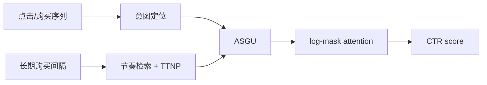

# SAM：购买后兴趣退出与个性化恢复周期

> **Fidelity: 核心机制复现**。双路径 intent/rhythm、ASGU、log-mask intervention 与 TTNP 周期监督均实际执行。

## 论文信息

| 项目 | 内容 |
| --- | --- |
| 论文链接 | [arXiv 2607.12714](https://arxiv.org/abs/2607.12714) |
| 公司/机构 | Alibaba Group |
| 首次公开日期 | 2026-07-14（arXiv v1） |
| 原文开源代码 | 否：未找到作者公开代码（核查日期：2026-07-16） |
| Adapter | `sam` |
| 本地复现代码 | [`src/auto_research/reproductions/sam/`](https://github.com/daiwk/auto-research/tree/main/src/auto_research/reproductions/sam/) |

## 原始论文总结

### 背景与主要改动

购买完成的是一簇意图，继续放大购买前点击会制造重复推荐。SAM 用 pointwise cross-attention 定位要压制的历史节点，并从长期购买序列预测补货节奏；ASGU 在刚购买时强抑制、接近周期时逐渐恢复，再以 log-mask 修改注意力 logits。



### 核心公式

$$
m_{ij}=1-a_j\sigma\left(k\left(\alpha-\frac{\Delta t_{ij}}{c}\right)\right),\qquad \ell_{ij}=q_i^Tk_j/\sqrt d+\log\operatorname{clip}(m_{ij},\epsilon,1).
$$

### 论文离线与线上效果

相对 DIN：线上 CTR `+1.1%`、GMV `+0.9%`、bad-case `-74.5%`；论文 PPRR 从 `15.5%` 降至 `4.1%`。

## 本地复现

> **本地对照口径**：基线是 DIN-like interest score；实验组 SAM 加入按 genre 学习的周期与 ASGU，相对基线 Hit@10 **`-12.50%`**、NDCG@10 **`-6.60%`**。

公开数据没有购买事件，使用高分 genre 重复间隔代理，因此负结果不外推论文线上结论。稳定指标见 [`metrics/movielens-100k-seed42.json`](metrics/movielens-100k-seed42.json)。

```bash
auto-research reproduce --paper sam --seed 42
```

## 复现边界

没有真实补货型商品和 censored purchase log；只验证机制和失败边界。
