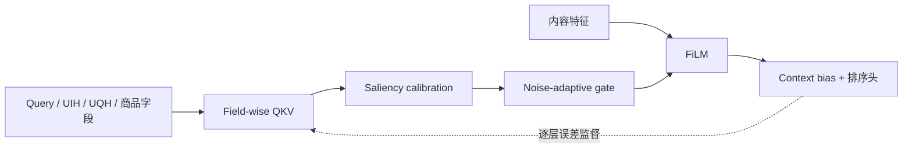

# TMallGS：生成式电商搜索的统一特征与序列建模

> **复现保真度：核心机制复现。** 真实训练 field-adaptive 交互和 progressive loss；天猫私有字段与生产规模未复刻。

## 论文信息

| 字段 | 内容 |
|---|---|
| 论文链接 | [arXiv 2607.13398](https://arxiv.org/abs/2607.13398) |
| 公司/机构 | 淘天集团 |
| 首次公开日期 | 2026-07-15（arXiv v1） |
| 原文开源代码 | 否：未发现原作者公开代码 |
| Adapter | `tmallgs` |
| 本地复现代码 | [`src/auto_research/reproductions/tmallgs/`](https://github.com/daiwk/auto-research/tree/main/src/auto_research/reproductions/tmallgs/) |

## 原始论文总结

### 背景与主要改动

电商搜索同时包含 query、短期/长期行为、用户和商品等异构字段，直接拼 token 会放大字段噪声。TMallGS 为不同字段学习独立 Q/K/V，用 distribution-calibrated saliency 和 noise-adaptive gate 控制交互；内容特征通过 FiLM 注入，context bias 修正最终分数，并用中间层误差自适应分配 progressive supervision。



### 核心公式

$$
\tilde a_{ij}^{(f)}
=g_f(x)\cdot
\operatorname{softmax}_j
\left(\frac{Q_f(x_i)K_f(x_j)^\top}{\sqrt d}
+b_f\right),
$$

$$
h'=\gamma(c)\odot h+\beta(c),\qquad
\mathcal L=\sum_l\alpha_l(\epsilon_l)\mathcal L_l.
$$

### 论文离线与线上效果

论文离线报告 PV-AUC +0.79%、IMP-GAUC +0.34%。天猫搜索 30 天 A/B（$p<0.05$）中 UCTCVR +1.38%、GMV +1.52%，线上延迟增加约 6 ms。

## 本地复现

本地把 MovieLens 类型和序列映射为异构字段，真实训练 field-wise QKV、噪声门控、显式内容 FiLM、context bias 和 error-aware progressive loss。

> **本地对照口径**：基线为 DIN/RankMixer 风格 late-fusion Transformer，实验组为 TMallGS field-adaptive gated Transformer；seed 42 的 NDCG@10 从 0.00068 升至 0.00278，相对 +310.42%。

稳定指标见 `metrics/movielens-100k-seed42.json`。绝对命中数很少，结果主要证明各训练模块能组成完整可运行路径，不代表 0.05B 天猫生产模型的统计稳定性。

```bash
auto-research reproduce --paper tmallgs --dataset-dir data --seed 42
```
