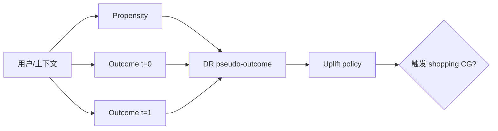
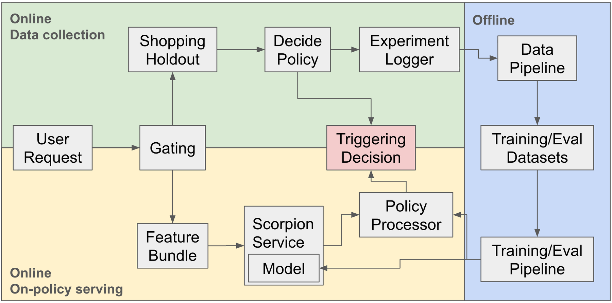

# Pinterest 因果召回：用 uplift 决定是否触发电商候选

> **Fidelity: 核心机制复现**。执行 propensity、双 outcome、DR pseudo-outcome 和触发阈值。

## 论文信息

| 项目 | 内容 |
| --- | --- |
| 论文链接 | [arXiv 2607.14161](https://arxiv.org/abs/2607.14161) |
| 公司/机构 | Pinterest |
| 首次公开日期 | 2026-07-14（arXiv v1） |
| 原文开源代码 | 否：论文未提供官方/作者代码（核查日期：2026-07-28） |
| Adapter | `causal-retrieval` |
| 本地复现代码 | [`src/auto_research/reproductions/causal_retrieval/`](https://github.com/daiwk/auto-research/tree/main/src/auto_research/reproductions/causal_retrieval/) |

## 原始论文总结

### 背景与主要改动

始终触发 shopping candidate generator 浪费资源，也会向无购物意图用户过度分发。论文用随机日志学习多事件 outcome 和 doubly-robust uplift，离线线性 replay 选阈值，线上与远程召回并行执行。



<!-- paper-figure:start -->
### 原论文关键图

[](https://arxiv.org/html/2607.14161v2/sys_overview.png)

> **原论文 Figure 1（关键图）**：展示原论文的训练流程与关键优化环节。图片来自[原论文](https://arxiv.org/abs/2607.14161)，版权归原作者所有；点击图片可查看来源。
<!-- paper-figure:end -->

### 核心公式

$$
\tilde\tau(x)=\hat\mu_1-\hat\mu_0+
\frac{t(y-\hat\mu_1)}{\hat e(x)}
-\frac{(1-t)(y-\hat\mu_0)}{1-\hat e(x)}.
$$

### 论文离线与线上效果

shopping trigger 最多减少 `85%`，shopping session 中性，总 session `+0.26%`、Pin Save `+1.10%`。

## 本地复现

> **本地对照口径**：基线是固定的非因果 transition/content/popularity retrieval ensemble；实验组以 DR uplift 选择约 30% shopping trigger，NDCG@10 `0.03540→0.06399`，相对 **+80.77%**。

该大幅提升来自公开数据上的合成随机 treatment，不能视为 Pinterest 复现；价值在验证完整因果训练路径。见 [`metrics/movielens-seed42.json`](metrics/movielens-seed42.json)。

```bash
auto-research reproduce --paper causal-retrieval --dataset-dir data --seed 42
```

## 复现边界

没有 Pinterest randomized logs、购物 session 或 RPC 成本；本地 pseudo-treatment 仅用于可辨识的机制实验。
