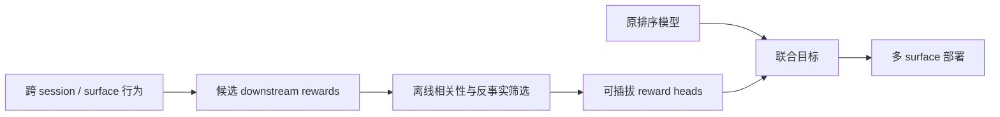

# Downstream Rewards：模型无关的长期参与度优化

> **复现保真度：核心机制复现。** 真实执行 reward 筛选与附加头；Pinterest 私有跨 surface 长期标签未复刻。

## 论文信息

| 字段 | 内容 |
|---|---|
| 论文链接 | [arXiv 2607.14192](https://arxiv.org/abs/2607.14192) |
| 公司/机构 | Pinterest |
| 首次公开日期 | 2026-07-15（arXiv v1） |
| 原文开源代码 | 否：未发现原作者公开代码 |
| Adapter | `downstream-rewards` |
| 本地复现代码 | [`src/auto_research/reproductions/downstream_rewards/`](https://github.com/daiwk/auto-research/tree/main/src/auto_research/reproductions/downstream_rewards/) |

## 原始论文总结

### 背景与主要改动

只优化当前点击或保存可能牺牲用户后续活跃。Pinterest 的方法先离线提出并筛选能预测未来参与度的 downstream rewards，再把通过筛选的 reward head 作为模型无关附加目标接入 Homefeed、Search、Related Pins 和 Notifications 等不同系统，无需替换原有主排序器。



### 核心公式

$$
r_k=\phi_k(s_t,a_t,s_{t+1:t+H}),\qquad
\mathcal K=\{k:\operatorname{Corr}(r_k,Y_{\mathrm{long}})>\tau\},
$$

$$
s_{\mathrm{final}}=s_{\mathrm{immediate}}+
\sum_{k\in\mathcal K}\lambda_k\hat r_k.
$$

### 论文离线与线上效果

线上 A/B 报告：Homefeed successful sessions +0.36%、total time 最高 +0.35%；Search fulfillment +0.25%；Related Pins successful sessions +0.15%；Notifications successful sessions +0.14%、WAU +0.11%。

## 本地复现

本地从 deeper transition、content depth、new use-case exploration 和 shallow closeup 四类 session 信号出发，以未来类型覆盖代理长期参与度做离线筛选，训练独立 reward head，再在 validation 上选择与即时排序分数的融合强度。

> **本地对照口径**：基线为即时 next-item engagement，实验组加入筛选后的 downstream reward；seed 42 的 NDCG@10 从 0.02629 降至 0.02495，相对 -5.10%，本地没有验证到排序收益。

稳定指标见 `metrics/movielens-100k-seed42.json`。Pinterest 的 save/download/P2P 与跨 surface 留存标签无法由 MovieLens 完整替代，负结果被保留为适用边界。

```bash
auto-research reproduce --paper downstream-rewards --dataset-dir data --seed 42
```
