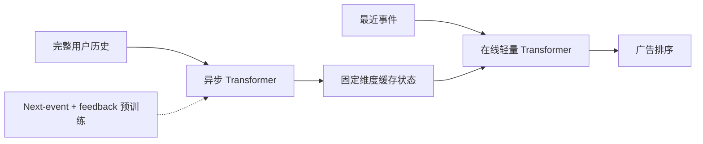

# Long-History User Transformers：实时广告排序中的长历史

> **复现保真度：核心机制复现。** 真实训练离线缓存与在线近期双 encoder；Yandex 生产特征系统未复刻。

## 论文信息

| 字段 | 内容 |
|---|---|
| 论文链接 | [arXiv 2607.14331](https://arxiv.org/abs/2607.14331) |
| 公司/机构 | Yandex |
| 首次公开日期 | 2026-07-15（arXiv v1） |
| 原文开源代码 | 否：未发现原作者公开代码 |
| Adapter | `long-history-transformer` |
| 本地复现代码 | [`src/auto_research/reproductions/long_history_transformer/`](https://github.com/daiwk/auto-research/tree/main/src/auto_research/reproductions/long_history_transformer/) |

## 原始论文总结

### 背景与主要改动

广告排序需要长历史，但请求时重算完整序列会增加延迟。论文把系统拆成异步 full-history Transformer 和在线 lightweight Transformer：离线部分周期性刷新固定维度用户状态，在线只编码最近事件并读取缓存；训练先用 next-event 与 feedback 辅助任务预训练，再针对目标广告 surface 微调。



### 核心公式

$$
z_u=\operatorname{Cache}\!\left(
\operatorname{Transformer}_{\mathrm{offline}}(H_u)
\right),
$$

$$
\hat y=\operatorname{Ranker}\!\left(
\operatorname{Transformer}_{\mathrm{online}}(H_u^{\mathrm{recent}},z_u),x_{\mathrm{ad}}
\right).
$$

### 论文离线与线上效果

Yandex Search Ads 的主指标 +2.77%、clicks +2.87%、revenue +2.26%；Yandex Advertising Network 的主指标 +2.10%、clicks +2.59%、revenue +0.43%。论文报告服务延迟没有增加。

## 本地复现

代码实际训练 24 步长的离线历史 encoder、32 维缓存、仅查看最近 4 个事件的在线 encoder，以及 next-item/feedback 辅助目标；基线只能在请求时查看最近 4 个事件。

> **本地对照口径**：基线为 request-time recent-history Transformer，实验组为缓存全历史加轻量在线 Transformer；seed 42 的 NDCG@10 从 0.00187 升至 0.00294，相对 +57.08%。

稳定指标见 `metrics/movielens-100k-seed42.json`。本地没有 Yandex 跨 surface 日志、CatBoost 下游和 feature-store 刷新系统，服务成本结论只保留结构分析。

```bash
auto-research reproduce --paper long-history-transformer --dataset-dir data --seed 42
```
