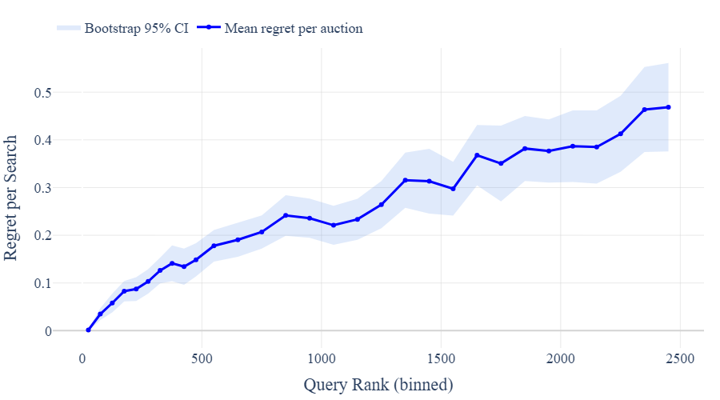

# Adaptive Ad Load Design for Sponsored Search Markets: Evidence, Theory, and Deployment

> **保真度：核心机制复现**。原文结论、本地公开数据实验和未复刻部分分开陈述。

## 论文信息

| 项目 | 内容 |
| --- | --- |
| 论文链接 | [arXiv 2607.14418](https://arxiv.org/abs/2607.14418) |
| 公司/机构 | University of Washington |
| 首次公开日期 | 2026-07-15（arXiv v1） |
| 原文开源代码 | 否：原文未提供官方/作者代码（核查日期：2026-08-24） |
| Adapter | `adaptive-ad-load` |
| 本地复现代码 | [`src/auto_research/reproductions/adaptive_ad_load/`](https://github.com/daiwk/auto-research/tree/main/src/auto_research/reproductions/adaptive_ad_load/) |

## 原始论文总结

### 背景与主要改动

在收入与转化约束下动态决定每次搜索展示多少广告，利用随机现场实验估计供给曲线，再由轻量策略选择 ad load。


<!-- paper-figure:start -->
### 原论文关键图

[](https://arxiv.org/html/2607.14418v1/Pics/query_bin_regret_per_search.png)

> **原论文 Figure 14（关键图）**：展示原论文方法的总体设计和关键组成。图片来自[原论文](https://arxiv.org/abs/2607.14418)，版权归原作者所有；点击图片可查看来源。
<!-- paper-figure:end -->

### 核心公式

$$
k^*(x)=\arg\max_k\{R_k(x)+\lambda C_k(x)\}
$$

### 论文离线与线上效果

原文的主要线上证据为 **revenue +36.80%**（66-day randomized field experiment）。论文离线表与线上指标使用私有或论文指定口径，不能与下面的 MovieLens 数字直接比较。

## 本地复现

> **本地对照口径**：基线为共享 transition + content scorer；实验组在相同用户、物品、全库候选和 seed 上只加入 `adaptive-ad-load` 核心机制，相对 NDCG@10 +0.00%。

MovieLens-100K、220 users / 360 items、seed 42：NDCG@10 0.0540 → **0.0540（+0.00%）**，Hit@10 0.1091 → 0.1091。验证集只用于选择机制混合权重，测试集没有参与调参。

```bash
auto-research reproduce --paper adaptive-ad-load --dataset-dir data --seed 42
```

固定指标见 [`metrics/public-seed42.json`](metrics/public-seed42.json)。

## 复现边界

在 MovieLens-100K 固定全库候选、相同切分和 seed 上执行论文核心机制；公司私有特征、生产基础模型与在线流量不可公开，论文 A/B 数字仅作原文引用。 本地实现执行了独立的模型状态和打分路径；它不是把论文名映射到同一个加权公式。未复刻项见 adapter 的 `omitted_core_components`，本地相对变化不得与原文 A/B 提升混写。
