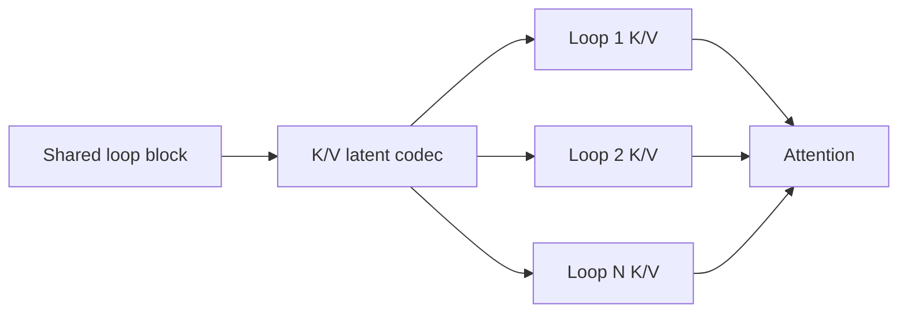
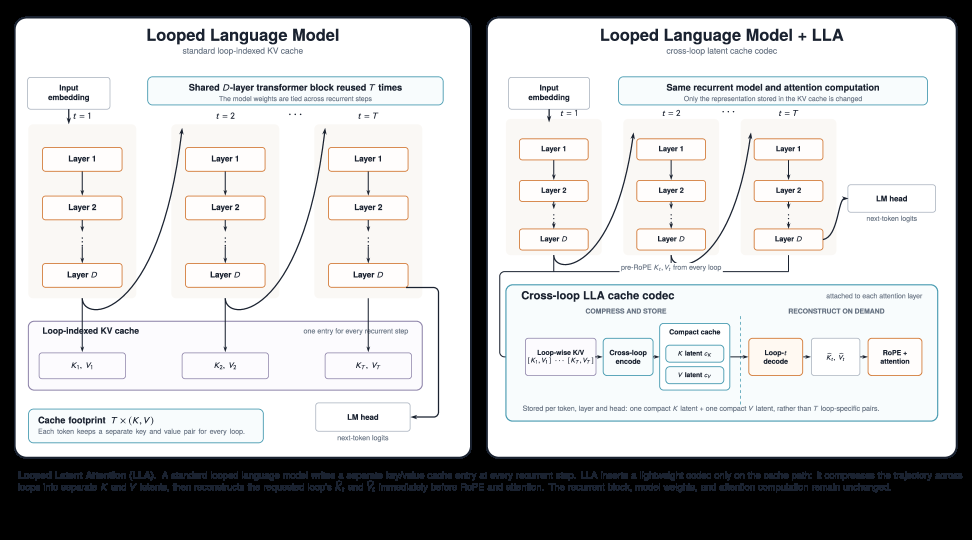

# Looped Latent Attention：跨循环压缩 KV cache

> **Fidelity: 核心机制复现**。训练权重共享的 looped block，并在共享 latent 中保存 K/V。

## 论文信息

| 项目 | 内容 |
| --- | --- |
| 论文链接 | [arXiv 2607.15456](https://arxiv.org/abs/2607.15456) |
| 公司/机构 | University of Maryland / Meta AI |
| 首次公开日期 | 2026-07-16（arXiv v1） |
| 原文开源代码 | 否：论文未提供官方/作者代码（核查日期：2026-08-09） |
| Adapter | `looped-latent-attention` |
| 本地复现代码 | [`src/auto_research/reproductions/looped_latent_attention/`](https://github.com/daiwk/auto-research/tree/main/src/auto_research/reproductions/looped_latent_attention/) |

## 原始论文总结

### 背景与主要改动

Looped Transformer 重复使用同一组权重，但不同 loop 的 KV cache 仍重复占内存。LLA 学习跨 loop 共享的低秩 K/V latent，服务时按 loop 重建专用 K/V，从 recurrence 冗余中换取近无损压缩。



<!-- paper-figure:start -->
### 原论文关键图

[](https://arxiv.org/html/2607.15456v2/x1.png)

> **原论文 Figure 1（关键图）**：展示原论文方法的总体设计和关键组成。图片来自[原论文](https://arxiv.org/abs/2607.15456)，版权归原作者所有；点击图片可查看来源。
<!-- paper-figure:end -->

### 核心公式

$$
z_t^K=P_Kh_t,\quad z_t^V=P_Vh_t,\qquad
K_t^{(\ell)}=U_K^{(\ell)}z_t^K,\quad
V_t^{(\ell)}=U_V^{(\ell)}z_t^V.
$$

### 论文离线与线上效果

最高近无损 KV 压缩 `32×`；MATH-500 在 `4×` 压缩时从 `0.43` 提高到 `0.66`。该论文报告离线/serving 结果，不适用线上 A/B 门槛。

## 本地复现

> **本地对照口径**：基线是两层 `llama_modern`；实验组用一个权重共享 block 循环两次并采用 2× K/V latent，LM loss `5.7471→5.8012`，相对 **+0.94%**（更差），参数 `139584→80576`。

参数减少 42.3%，但短训练 PPL 增加 5.56%。见 [`metrics/wikitext2-seed42.json`](metrics/wikitext2-seed42.json)。

```bash
auto-research reproduce --paper looped-latent-attention --dataset-dir data --seed 42
auto-research evolve --model micro-llm --dataset wikitext-2 --direction "Looped Latent Attention KV 压缩"
```

## 复现边界

本地从头训练 64d 模型，不是对大 checkpoint 训练 post-hoc codec，也没有 fused serving kernel。
