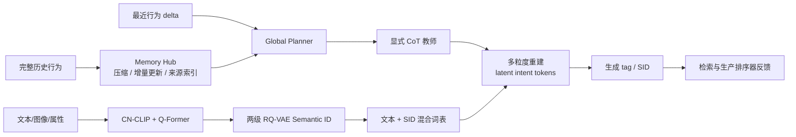

# RecGPT-V3：有状态、混合模态的生成式推荐

> **Fidelity: 核心机制复现**。实际训练两级 Semantic ID、结构化 Memory Hub、显式教师到 latent token 的重建蒸馏和 ranking-feedback；基础模型、数据与线上系统缩小。

## 论文信息

| 项目 | 内容 |
| --- | --- |
| 论文链接 | [arXiv 2607.15591](https://arxiv.org/abs/2607.15591) |
| 公司/机构 | Alibaba / Taobao |
| 首次公开日期 | 2026-07-17（arXiv v1） |
| 原文开源代码 | 否：论文未提供官方/作者代码（核查日期：2026-07-22） |
| Adapter | `recgpt-v3` |
| 本地复现代码 | [`src/auto_research/reproductions/recgpt_v3/`](https://github.com/daiwk/auto-research/tree/main/src/auto_research/reproductions/recgpt_v3/) |

## 原始论文总结

### 背景与主要改动

RecGPT-V1 把用户意图引入推荐链路，V2 用多智能体扩展推理，但每次请求仍重复读取最长约 55K token 的完整历史；自然语言 tag 到商品又形成有损瓶颈，显式 CoT 的数千 token 也无法承受高 QPS。V3 同时改造三处：

1. **Memory Hub** 将完整行为压成带行为模式、偏好摘要、原始行为索引和时间信息的可追溯 memory unit；新行为只更新相关 unit 或创建新 unit。
2. **Hybrid-modal foundation model** 用 CN-CLIP/Q-Former 融合内容，再以两级 RQ-VAE 把商品量化成 SID；Qwen3-14B 的词表加入 65,536 个 SID token，并经过 CPT 与 SFT 学习 `SID↔文本` 和 `SID→SID`。
3. **Latent Intent Reasoning** 把教师的长 CoT 分段压入最多 10 个 latent token，通过单段、多段和全链重建训练保持可解释性，再用生产排序器的 CTRScore 做 RLRF。



### 核心公式

Memory Hub 的初始压缩与增量更新为：

$$
\mathcal M=\mathcal F_\phi(\mathcal B),\qquad
\mathcal M^{(t+\delta)}=\mathcal G\!\left(\mathcal M^{(t)},\Delta\mathcal B^{(t,t+\delta)}\right).
$$

两级 RQ-VAE 把 item embedding 量化为 $\mathrm{SID}(i)=(c_1,c_2)$；模型同时训练 `sid2title`、`title2sid`、`sid2tag`、`tag2sid`、`sid2cmd` 和序列 `sid2sid`。

显式推理 $R$ 被分为 $K$ 段并替换为 latent token：

$$
K=\min\!\left(\left\lceil\frac{N}{C}\right\rceil,K_{\max}\right),\qquad
\mathcal L(\mathcal J)=-\log p_\theta\!\left(R_{\mathcal J}\mid c(\mathcal J),\mathcal P\right).
$$

RLRF 直接从下游排序器取得 dense reward：

$$
r_{\mathrm{ctr}}(y)=\frac{1}{K}\sum_{k=1}^{K}s_k,\qquad
\mathcal R(y)=r_{\mathrm{ctr}}(y)\prod_{q\in\{\mathrm{align,div,len}\}}\mathbf 1[q(y)\ge\tau_q].
$$

### 论文离线与线上效果

- Memory Hub 的 pattern/index 人工准确率为 `82.89% / 95.27%`，Global Planner 总计算成本相对 V2 降低 `55.8%`。
- 混合模型以 Qwen3-14B 为底座；掺入通用数据后 GSM8K 仅从 `94.31%` 降至 `92.65%`，不掺通用数据则降至 `4.70%`，说明 CPT/SFT 不能只喂推荐数据。
- latent reasoning 将约 2,300-token 显式推理压至最多 10 个 latent token，论文报告推理 token 成本约降 `200×`；端到端 serving resource 降低 `52.4%`。
- 淘宝“猜你喜欢”各取 `1%` 实验/对照流量，以 RecGPT-V2 为基线。Item 场景 IPV `+3.08%`、CTR `+0.98%`、TC `+3.10%`、GMV `+7.51%`；Feed 场景 IPV `+1.28%`、CTR `+1.00%`、DAU `+0.56%`、TC `+1.97%`、GMV `+3.97%`。

## 本地复现

> **本地对照口径**：基线是同一 MovieLens-1M split、item tower 和训练步数下，重算完整 40-event 历史的无状态 hybrid Transformer；实验组加入 6-slot Memory Hub、8 个最近事件、4 个 latent token、教师预热和重建/ranking-feedback。最终 NDCG@10 相对 **`+36.96%`**。

使用 360 users / 520 items 的 MovieLens-1M 子集，全物品排序、seed 42。基线 Hit@10/NDCG@10 为 `0.0556 / 0.0279`，V3 为 `0.0778 / 0.0382`；memory 输入从 40 降到 14 token（`-65.00%`），latent reasoning slot 从 40 降到 4（`-90.00%`），重建 cosine `0.8189`。实验组 head share 同时从 `0.1108` 升至 `0.1900`，说明本地收益伴随更强热门集中，不能只看 NDCG。

第一轮让教师与学生同步漂移时，NDCG 相对基线为 `-26.65%`；第二轮改为先预热并冻结显式教师，再做 latent internalization，才得到当前结果。这是本次多轮迭代选中的设置。稳定指标见 [`metrics/movielens-1m-seed42.json`](metrics/movielens-1m-seed42.json)。

```bash
auto-research reproduce --paper recgpt-v3 --seed 42
```

## 复现边界

本地真实训练了两级 RQ-VAE、SID/text item tower、显式教师、memory attention、latent 多段重建和 dense ranking-feedback KL；MovieLens genre 替代淘宝文本/图像/属性，520 items 替代工业商品池，公开 teacher+popularity reward 替代生产 CTR ranker。没有伪装成 Qwen3-14B CPT/SFT、DeepSeek-V3.2 教师、在线 GRPO 或生产资源测试；本地 `+36.96%` 不代表论文线上 lift。
