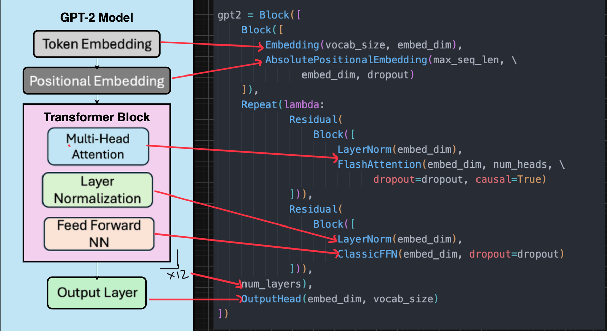

# OpenLanguageModel：面向教学与研究的可读可组合小模型预训练

> **Fidelity：核心机制复现**。公开数据只验证论文机制，不模拟生产流量。

## 论文信息

| 字段 | 内容 |
|---|---|
| 论文链接 | [arXiv 2607.16669](https://arxiv.org/abs/2607.16669) |
| 公司/机构 | Indian Institute of Technology Madras |
| 首次公开日期 | 2026-07-18（arXiv v1） |
| 原文开源代码 | 是：[openlanguagemodel/openlanguagemodel](https://github.com/openlanguagemodel/openlanguagemodel) |
| Adapter | `open-language-model` |
| 本地复现代码 | [`src/auto_research/reproductions/open_language_model/`](https://github.com/daiwk/auto-research/tree/main/src/auto_research/reproductions/open_language_model/) |

## 原始论文总结

### 背景与主要改动

许多预训练框架把模型结构、训练循环和分布式运行强耦合，难以做透明消融。OLM 让组件保持普通 PyTorch module，用 Block、Residual、Repeat、Parallel 描述布线，同一模型可从 notebook 迁移到 CPU、单 GPU 和单机多 GPU。


<!-- paper-figure:start -->
### 原论文关键图

[](https://arxiv.org/html/2607.16669v1/figures/gpt2-architecture-code.png)

> **原论文 Figure 1（关键图）**：展示原论文方法的总体设计和关键组成。图片来自[原论文](https://arxiv.org/abs/2607.16669)，版权归原作者所有；点击图片可查看来源。
<!-- paper-figure:end -->

### 核心公式

$$
h_{l+1}=\operatorname{Block}_l(h_l),\quad \operatorname{Residual}(f)(x)=x+f(x),\quad \operatorname{Parallel}(f,g)(x)=f(x)+g(x).
$$

### 论文离线与线上效果

提供 9 个模型家族的 27 个 preset；348M 参数四卡 weak-scaling efficiency 90.6%，并与独立参考实现高度一致。无生产 A/B。

## 本地复现

> **本地对照口径**：基线为同预算 LLaMA-modern，实验组为 `olm_composable`；相对 PPL -0.000001%。

新增 `olm_composable` genome，暴露普通 module、四种组合 operator 和 cpu/mps/cuda portability，并纳入实时论文检索后的 evolve 候选。

WikiText-2、30 steps、seed 42：同预算 LLaMA-modern PPL 313.27，OLM composable 313.27；两者参数量均为 139584。此实验验证组合 DSL 不改变执行语义，不把近零差异宣称为效果提升。

```bash
auto-research reproduce --paper open-language-model --dataset-dir data --seed 42
auto-research evolve --model micro-llm --dataset wikitext-2 --direction "探索 open-language-model 的已安装核心算子" --generations 2 --population 4
```

固定指标见 [`metrics/public-seed42.json`](metrics/public-seed42.json)。

## 复现边界

未搬运上游整个包和 27 个 preset，也未复刻 348M 四卡实验；本地验证结构语义和统一 evaluator 接口。
