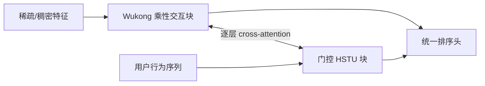

# WHALE：Wukong-HSTU 统一推荐模型

> **复现保真度：核心机制复现。** 真实训练 Wukong、HSTU 与逐层交换；Meta 私有特征规模和生产内核未复刻。

## 论文信息

| 字段 | 内容 |
|---|---|
| 论文链接 | [arXiv 2607.17017](https://arxiv.org/abs/2607.17017) |
| 公司/机构 | Meta Platforms, Inc. |
| 首次公开日期 | 2026-07-19（arXiv v1） |
| 原文开源代码 | 否：未发现原作者公开代码 |
| Adapter | `whale` |
| 本地复现代码 | [`src/auto_research/reproductions/whale/`](https://github.com/daiwk/auto-research/tree/main/src/auto_research/reproductions/whale/) |

## 原始论文总结

### 背景与主要改动

工业推荐通常把稀疏特征交互和用户行为序列分成两个模型，扩展规模时容易形成表示与算力割裂。WHALE 用 Wukong 分支递归建模高阶特征交互，用 HSTU 分支建模行为序列，并在每层用 cross-attention 双向交换状态，形成可共同扩展的统一网络。



### 核心公式

第 $l$ 层先分别更新两条分支，再交换信息：

$$
x_{l+1}=W_l(x_l)+\operatorname{Attn}(Q=x_l,K=h_l,V=h_l),
$$

$$
h_{l+1}=\operatorname{HSTU}_l(h_l)+
\operatorname{Attn}(Q=h_l,K=x_l,V=x_l).
$$

### 论文离线与线上效果

Meta 的 14 天线上 A/B 中，主指标 +0.113%，Metric 1 +0.824%，Metric 2 +1.820%；论文同时报告推理 QPS 约下降 5%，体现精度与服务成本的权衡。

## 本地复现

本地实际训练 Wukong 乘性交互、门控因果 HSTU 和逐层 cross-branch attention，并以同维度、同层数的 late-fusion Transformer 为直接对照。

> **本地对照口径**：基线为双分支 late fusion，实验组为 WHALE 渐进交换；seed 42 的 NDCG@10 从 0.00429 降至 0.00072，相对 -83.20%，未在 MovieLens 小数据上迁移论文收益。

稳定指标见 `metrics/movielens-100k-seed42.json`。Meta 私有超稀疏特征、训练规模以及 Triton/AOTInductor 内核未复刻；负结果说明该结构不适合据此宣称“小数据也必然提升”。

```bash
auto-research reproduce --paper whale --dataset-dir data --seed 42
```
