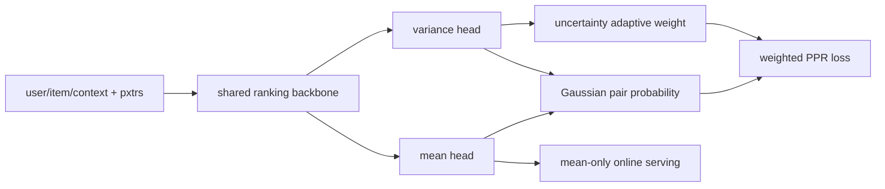

# UAME：用预测不确定性缓解多目标满意度偏差

> **Fidelity: 核心机制复现**。训练 Gaussian score 双头、概率 pairwise loss、冲突约束与不确定性加权；私有八路 pxtr 和生产 backbone 用公开 proxy 替代。

## 论文信息

| 项目 | 内容 |
| --- | --- |
| 论文链接 | [arXiv 2607.17092](https://arxiv.org/abs/2607.17092) |
| 公司/机构 | Kuaishou Technology |
| 首次公开日期 | 2026-07-19（arXiv v1） |
| 原文开源代码 | 否：论文未提供官方/作者代码（核查日期：2026-07-22） |
| Adapter | `uame` |
| 本地复现代码 | [`src/auto_research/reproductions/uame/`](https://github.com/daiwk/auto-research/tree/main/src/auto_research/reproductions/uame/) |

## 原始论文总结

### 背景与主要改动

点击、观看、点赞等 pxtr 只是不可观测“真实满意度”的冲突代理。UAME 在 EMER/EASQ 主干上增加共享表征的均值与方差双头，把分数视作 Gaussian 变量；用解析 pair probability 联合各 pxtr，令冲突更高的 pair 获得更大训练权重。线上只使用均值打分，因此不增加 serving 路径。



### 核心公式

$$
\hat y_i=\mu_i+\sigma_i\epsilon_i,\quad
P(\hat y_i>\hat y_j)=\Phi\!\left(\frac{\mu_i-\mu_j}{\sqrt{\sigma_i^2+\sigma_j^2}}\right).
$$

$$
\omega_{ij}=\gamma\frac{U_{ij}-\min U}{\max U-\min U},\quad
U_{ij}=\sigma_i^2+\sigma_j^2.
$$

最终目标为多 pxtr weighted PPR，加方差正则和 pxtr 冲突辅助约束。

### 论文离线与线上效果

离线在 EMER 上最高相对提升 `5.8%`，EASQ 上 plvtr `+14.2%`。两组各取主 feed `5%` 流量、运行 7 天且 `p<0.005`：对 EMER 的 LongView `+1.614%`、Forward `+1.325%`；对 EASQ 的 LongView `+1.126%`、Forward `+1.598%`。

## 本地复现

> **本地对照口径**：基线是同 backbone 的 deterministic multi-objective pairwise ranker；实验组加入完整 UAME loss，NDCG@10 相对 **`-62.28%`**。

MovieLens-100K 固定 220 users / 360 items；transition、genre similarity、popularity 作为三路 proxy，并按候选在三路目标中的 rank 标准差构造冲突。基线/UAME NDCG@10 `0.05798 / 0.02187`，训练 loss 均正常下降，但 UAME 将 head share 从 `0.6736` 降到 `0.0764`，公开 proxy 的冲突结构与下一物品满意度明显不匹配。稳定指标见 [`metrics/movielens-100k-seed42.json`](metrics/movielens-100k-seed42.json)。

```bash
auto-research reproduce --paper uame --seed 42
```

## 复现边界

未获得快手八路 pxtr、EMER/EASQ、问卷满意度和亿级流量；本地负结果说明这一公开 proxy 映射不能直接复现论文收益，不与线上 lift 混写。
