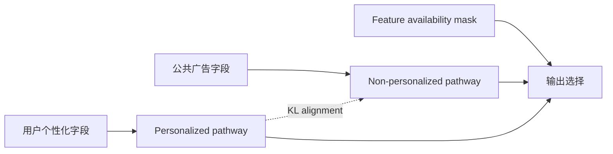

# RAMP：个性化特征受限时的鲁棒广告推荐

> **复现保真度：核心机制复现。** 真实训练 masked 双路径与 prediction alignment；私有工业 CVR 数据未复刻。

## 论文信息

| 字段 | 内容 |
|---|---|
| 论文链接 | [arXiv 2607.17473](https://arxiv.org/abs/2607.17473) |
| 公司/机构 | Huawei Ireland Research Center、University College Dublin |
| 首次公开日期 | 2026-07-20（arXiv v1） |
| 原文开源代码 | 是：[Ruixinhua/RAMP](https://github.com/Ruixinhua/RAMP) |
| Adapter | `ramp` |
| 本地复现代码 | [`src/auto_research/reproductions/ramp/`](https://github.com/daiwk/auto-research/tree/main/src/auto_research/reproductions/ramp/) |

## 原始论文总结

### 背景与主要改动

隐私选择、权限或平台限制会让同一广告模型在部分流量上拿不到个性化字段。RAMP 不把缺失值简单填零，而是显式维护 personalized 与 non-personalized 两条路径，用可用性 mask 控制输出，并通过 prediction alignment 把富特征路径的知识蒸馏给受限路径。



### 核心公式

$$
\hat y=m\hat y_{\mathrm{personal}}+(1-m)\hat y_{\mathrm{public}},
$$

$$
\mathcal L=\mathcal L_{\mathrm{CTR}}+
\lambda\,\operatorname{KL}\!\left(
p_{\mathrm{personal}}\;\|\;p_{\mathrm{public}}
\right).
$$

### 论文离线与线上效果

论文公开数据上的 AUC 相对增益约 0.10%–0.87%，离线显著性 $p<0.001$。工业 CVR 线上 A/B 报告 Total Advertiser Value 提升超过 3%。

## 本地复现

MovieLens 行为向量代理受限个性化字段、类型特征代理公共广告字段；训练中实际执行双路径、输出 masking 和富特征 teacher 到受限路径的 KL 对齐，测试专门评估无个性化字段流量。

> **本地对照口径**：基线为缺失个性化字段的共享 CTR tower，实验组为 RAMP masked dual tower；seed 42 的 NDCG@10 从 0.00103 升至 0.00533，相对 +417.23%。

稳定指标见 `metrics/movielens-100k-seed42.json`。绝对指标较低且公开代理任务远小于工业 CVR，因此这里只证明缺失特征路径的相对鲁棒性。

```bash
auto-research reproduce --paper ramp --dataset-dir data --seed 42
```
