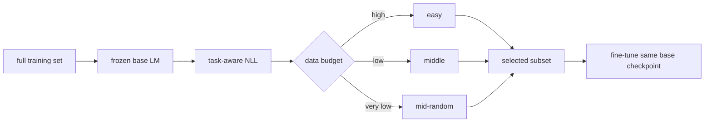

# PPL-Factory：随任务与预算变化的数据选择

> **Fidelity: 核心机制复现**。真实训练冻结 scorer、逐块计算 NLL，并从同一 checkpoint 对 random/easy/middle 子集做同预算微调。

## 论文信息

| 项目 | 内容 |
| --- | --- |
| 论文链接 | [arXiv 2607.18199](https://arxiv.org/abs/2607.18199) |
| 公司/机构 | McGill University |
| 首次公开日期 | 2026-07-20（arXiv v1） |
| 原文开源代码 | 否：论文未提供官方/作者代码（核查日期：2026-07-22） |
| Adapter | `ppl-factory` |
| 本地复现代码 | [`src/auto_research/reproductions/ppl_factory/`](https://github.com/daiwk/auto-research/tree/main/src/auto_research/reproductions/ppl_factory/) |

## 原始论文总结

### 背景与主要改动

固定的“选最难/最容易”规则会随任务和数据预算失效。PPL-Factory 先用冻结基础模型计算任务相关 NLL：语言建模按 packed block，推理 SFT 只看 reasoning/answer response；再按预算切换策略，高预算偏 easy，较低预算选 middle，极低预算从 middle pool 随机抽样以保覆盖。



### 核心公式

语言模型 block 的分数为：

$$
s_i^{\mathrm{LM}}=\frac{1}{B-1}\sum_{t=1}^{B-1}-\log p_\theta(b_{i,t+1}\mid b_{i,1:t}).
$$

论文把选择分布写成效用与覆盖的折中：

$$
Q_\rho^*(s)\propto P(s)\exp\!\left(u_\rho(s)/\lambda_\rho\right).
$$

### 论文离线与线上效果

GSM8K 上仅用 `1%` 数据即超过对比选择方法；`10%` 数据时相对 full-data fine-tuning，GSM8K `+0.9` point、MATH `+4.8` points。纯 LLM 论文不适用线上 A/B 门槛。

## 本地复现

> **本地对照口径**：基线是 20% 随机 block；实验组按论文预算规则选择 median 附近 block，test perplexity 相对 **`-1.79%`**（即变差 `1.79%`）。

WikiText-2 上冻结 25-step scorer，对 65-token block 打 NLL；三组各选 430 blocks，并从同一 checkpoint 训练 45 steps。Random/Easy/PPL-Factory test PPL 分别为 `329.214 / 324.926 / 335.097`：本地 20% 预算下 easy 最好，论文的 middle 规则没有迁移成功。稳定指标见 [`metrics/wikitext-2-seed42.json`](metrics/wikitext-2-seed42.json)。

```bash
auto-research reproduce --paper ppl-factory --seed 42
```

## 复现边界

只复现 CLM packed-block 分支；未运行 Qwen2.5-7B、GSM8K/MATH response-only NLL 和答案准确率。负结果保留，不外推为对原论文的否定。
