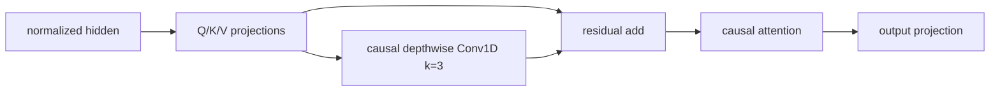

# Convolution for LLMs：用轻量局部卷积补足注意力

> **Fidelity: 核心机制复现**。真实预训练同预算 Transformer 与 post-QKV residual depthwise Conv1D；缩小模型和语料规模。

## 论文信息

| 项目 | 内容 |
| --- | --- |
| 论文链接 | [arXiv 2607.18413](https://arxiv.org/abs/2607.18413) |
| 公司/机构 | Huawei / Peking University / Tsinghua University |
| 首次公开日期 | 2026-07-20（arXiv v1） |
| 原文开源代码 | 否：截至 2026-07-22 未找到作者公开代码 |
| Adapter | `conv-llm` |
| 本地复现代码 | [`src/auto_research/reproductions/conv_llm/`](https://github.com/daiwk/auto-research/tree/main/src/auto_research/reproductions/conv_llm/) |

## 原始论文总结

### 背景与主要改动

自注意力擅长全局依赖，却没有显式的短程归纳偏置。论文固定 Qwen3 主干，系统比较 17 个卷积插入位置，最终选择在 Q/K/V 线性投影后、attention 聚合前加入 `kernel=3` 的逐通道一维卷积；残差旁路保留原投影，不加归一化或激活，额外参数低于 `0.01%`。



### 核心公式

对拼接后的投影 $Z=[Q;K;V]$，局部增强为：

$$
\widetilde Z=Z+\operatorname{DWConv}_{k=3}(Z),\qquad
\operatorname{Attention}(\widetilde Q,\widetilde K,\widetilde V).
$$

本地实现使用左侧 padding，保证卷积不读取未来 token。

### 论文离线与线上效果

Qwen3-1.7B 消融中 perplexity 从 `13.42` 降至 `12.79`；在多个 Qwen3 尺寸和预训练 token 预算上，七项下游 benchmark 平均分整体提升。纯 LLM 论文不适用线上 A/B 门槛。

## 本地复现

> **本地对照口径**：基线是相同 96-d、3-layer、60-step Transformer；实验组仅增加 QKV 后残差 depthwise Conv1D，test perplexity 相对降低 **`0.29%`**。

WikiText-2、240k train tokens、32k test tokens；两组使用相同 seed、token、optimizer 和训练步数。Transformer PPL `305.664`，QKV-Conv `304.787`。稳定指标见 [`metrics/wikitext-2-seed42.json`](metrics/wikitext-2-seed42.json)。

```bash
auto-research reproduce --paper conv-llm --seed 42
```

## 复现边界

未运行 Qwen3-0.6B/1.7B/4B、论文大规模预训练语料和七项下游任务；本地结论只支持小模型短预算下的方向性收益。
