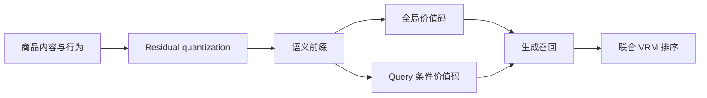

# TSGR：淘宝搜索生成式召回

> **复现保真度：核心机制复现。** 真实执行并行价值 Semantic ID 和联合 VRM；私有淘宝日志与生产 serving 未复刻。

## 论文信息

| 字段 | 内容 |
|---|---|
| 论文链接 | [arXiv 2607.18796](https://arxiv.org/abs/2607.18796) |
| 公司/机构 | 淘天集团、浙江大学 |
| 首次公开日期 | 2026-07-21（arXiv v1） |
| 原文开源代码 | 否：未发现原作者公开代码 |
| Adapter | `tsgr` |
| 本地复现代码 | [`src/auto_research/reproductions/tsgr/`](https://github.com/daiwk/auto-research/tree/main/src/auto_research/reproductions/tsgr/) |

## 原始论文总结

### 背景与主要改动

淘宝搜索的生成式召回不仅要找到相关商品，还要把商业价值直接带进生成路径。TSGR 先用 residual quantization 生成语义前缀，再为同一前缀下的商品并行分配全局价值码和 query-conditioned 价值码；最后用与生成 backbone 联合训练的 Value-aware Ranking Module（VRM）完成精细排序，避免把独立预排器硬接在生成器后面。



### 核心公式

物品标识由语义码和并行价值码构成：

$$
\operatorname{ID}(i,q)=(c_1,\ldots,c_L,v_i^{\mathrm{global}},v_{i,q}^{\mathrm{query}}).
$$

VRM 对生成状态、商品侧信息和价值信号联合打分：

$$
s(q,i)=f_\theta(h_q,e_i,v_i^{\mathrm{global}},v_{i,q}^{\mathrm{query}}),
\qquad
\mathcal L=-\sum_{i\in P_q}w_i\log \sigma(s_{q,i})
-\sum_{j\in N_q}\log \sigma(-s_{q,j}).
$$

### 论文离线与线上效果

论文离线 HR@1000 相对提升 9.16%。淘宝搜索 1% 流量、持续 38 天的 A/B 中，IPV +0.43%、成交笔数 +1.12%、GMV +1.64%，并报告已全量部署。

## 本地复现

本地在 MovieLens 100K 上真实构建两级 residual semantic prefix、全局/条件价值码，并用 23,027 个加权正例和 115,135 个负例拟合联合 VRM；融合权重只在 validation 上选择。

> **本地对照口径**：基线为语义召回加传统预排代理，实验组为 QP-SID 加联合 VRM；seed 42 的 NDCG@10 从 0.02629 升至 0.05672，相对 +115.73%。

稳定指标见 `metrics/movielens-100k-seed42.json`。这验证的是公开替代数据上的机制可运行性，不等同于淘宝私有 query、商业标签和 H20 beam-search 服务栈。

```bash
auto-research reproduce --paper tsgr --dataset-dir data --seed 42
```
