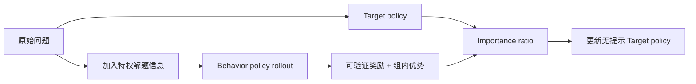

# Off-Context GRPO：用特权信息学习困难推理

> **复现保真度：核心机制复现。** 真实执行 privileged rollout 和 importance correction；Qwen2.5 大模型规模未复刻。

## 论文信息

| 字段 | 内容 |
|---|---|
| 论文链接 | [arXiv 2607.19313](https://arxiv.org/abs/2607.19313) |
| 公司/机构 | Meta AI、Columbia University |
| 首次公开日期 | 2026-07-21（arXiv v1） |
| 原文开源代码 | 是：[AgPriyank/OC-GRPO](https://github.com/AgPriyank/OC-GRPO) |
| Adapter | `off-context-grpo` |
| 本地复现代码 | [`src/auto_research/reproductions/off_context_grpo/`](https://github.com/daiwk/auto-research/tree/main/src/auto_research/reproductions/off_context_grpo/) |

## 原始论文总结

### 背景与主要改动

困难题上 vanilla GRPO 常因整组 rollout 都失败而没有有效优势信号。Off-Context GRPO 只在采样时向 behavior policy 提供解题草稿或提示等 privileged information，提高成功轨迹出现率；优化目标仍是原始无提示 policy，并用 importance ratio 校正两种采样分布的偏差，因此推理时不需要特权上下文。



### 核心公式

$$
\hat A_i=r_i-\frac{1}{G}\sum_{j=1}^{G}r_j,
\qquad
\rho_i=\frac{\pi_\theta(y_i\mid x)}
{q(y_i\mid x,z_{\mathrm{priv}})},
$$

$$
\mathcal L_{\mathrm{OC}}
=-\frac{1}{G}\sum_i
\operatorname{clip}(\rho_i)\hat A_i
\log\pi_\theta(y_i\mid x).
$$

### 论文离线与线上效果

这是纯 LLM 训练论文，不适用工业线上 A/B。论文在 Qwen2.5-7B 上相对 vanilla GRPO 提升 3.9 个绝对点、13.8% 相对；3B 与 1.5B 的相对提升分别为 7.2% 和 10.2%。

## 本地复现

脚本下载并使用官方 GSM8K。vanilla GRPO 从原问题采样；OC-GRPO 从包含官方解题过程的 behavior distribution 采样，计算 exact-answer reward、group-relative advantage 和 target/behavior importance correction。

> **本地对照口径**：基线为同 2,400 step、group size 8 的 vanilla GRPO，实验组为 Off-Context GRPO；seed 42 的 Pass@1 从 2.67% 升至 3.33%，相对 +25.00%。

稳定指标见 `metrics/gsm8k-seed42.json`。为保证 Mac CPU 可运行，本地使用可解释的数学候选策略而非 Qwen2.5 1.5B–7B token rollout；核心采样与校正算法是真实执行的，模型规模不是论文规模。

```bash
scripts/download_public_data.sh gsm8k
auto-research reproduce --paper off-context-grpo --dataset-dir data --seed 42
```
