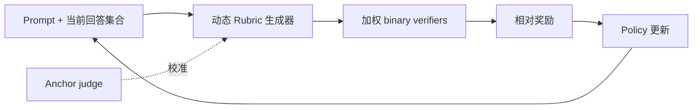

# DynamicRubric：评估器与策略协同进化

> **复现保真度：核心机制复现。** 真实执行动态 rubric 和多轮共进化；Qwen3 与生产 judge 规模未复刻。

## 论文信息

| 字段 | 内容 |
|---|---|
| 论文链接 | [arXiv 2607.20083](https://arxiv.org/abs/2607.20083) |
| 公司/机构 | 微信/Tencent、清华大学 |
| 首次公开日期 | 2026-07-22（arXiv v1） |
| 原文开源代码 | 否：未发现原作者公开代码 |
| Adapter | `dynamic-rubric` |
| 本地复现代码 | [`src/auto_research/reproductions/dynamic_rubric/`](https://github.com/daiwk/auto-research/tree/main/src/auto_research/reproductions/dynamic_rubric/) |

## 原始论文总结

### 背景与主要改动

固定 judge 或固定 rubric 会在策略模型进步后失去区分力。DynamicRubric 根据当前 prompt 和一组候选回答动态生成评估维度与权重，用 discriminability 目标寻找能区分当代 hard negatives 的标准，用 anchor 目标限制评估器漂移，再让 evaluator 和 policy 多轮协同进化。



### 核心公式

$$
R(x,y;\mathcal Y)=\sum_{k=1}^{K}
w_k(x,\mathcal Y)\,r_k(x,y),
$$

$$
\mathcal L_{\mathrm{eval}}
=-\log \sigma\!\left(R(x,y^+)-R(x,y^-)\right)
+\lambda\lVert w-w_{\mathrm{anchor}}\rVert_2^2.
$$

### 论文离线与线上效果

论文报告离线 evaluator 与 policy 均持续提升。微信搜索线上 A/B 在总搜索量、用户时长和绝对正反馈上均统计显著，且已覆盖全部 AI 回答流量、每天数千万请求；原文没有披露各指标的具体 lift，因此本文档不换算百分比。

## 本地复现

公开 Alpaca 回答与确定性截断/重排候选构成可审计偏好集；代码实际执行 response-set conditioned 权重生成、四项 binary rubric、discriminability/anchor 双目标和 policy-induced hard-negative 共进化。

> **本地对照口径**：基线为固定 prompt-only rubric policy，实验组为 DynamicRubric evaluator-policy 共进化；seed 42 的偏好准确率从 83.89% 升至 87.78%，相对 +4.64%。

稳定指标见 `metrics/alpaca-seed42.json`。本地使用紧凑文本策略以便 Mac CPU 运行，没有把它表述为 Qwen3-8B、70B/235B judge 的完整规模复现。

```bash
scripts/download_public_data.sh alpaca
auto-research reproduce --paper dynamic-rubric --dataset-dir data --seed 42
```
