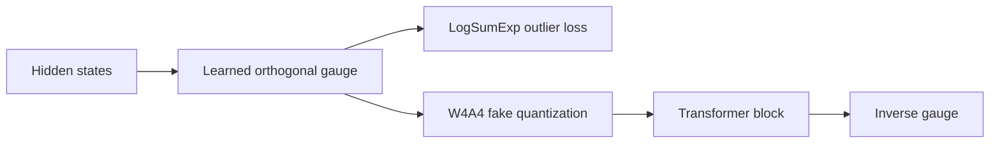
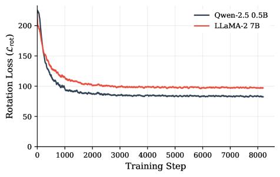

# GaugeQuant：训练中学习量化最优基

> **Fidelity: 核心机制复现**。真实学习正交 gauge、优化 outlier，并走 W4A4 STE 路径。

## 论文信息

| 项目 | 内容 |
| --- | --- |
| 论文链接 | [arXiv 2607.20757](https://arxiv.org/abs/2607.20757) |
| 公司/机构 | University of Cambridge |
| 首次公开日期 | 2026-07-22（arXiv v1） |
| 原文开源代码 | 是：[官方/作者代码](https://github.com/MPedraBento/gauge-quant) |
| Adapter | `gaugequant` |
| 本地复现代码 | [`src/auto_research/reproductions/gaugequant/`](https://github.com/daiwk/auto-research/tree/main/src/auto_research/reproductions/gaugequant/) |

## 原始论文总结

### 背景与主要改动

LLM 内部通道存在保持函数不变的 gauge 对称性，但不同等价基的量化误差差异很大。GaugeQuant 在训练中在线学习量化友好正交基，以 LogSumExp 压制 activation outliers，不需要额外 calibration corpus。



<!-- paper-figure:start -->
### 原论文关键图

[](https://arxiv.org/html/2607.20757v2/x1.png)

> **原论文 Figure 1（关键图）**：展示原论文的训练流程与关键优化环节。图片来自[原论文](https://arxiv.org/abs/2607.20757)，版权归原作者所有；点击图片可查看来源。
<!-- paper-figure:end -->

### 核心公式

$$
h'=hQ,\quad W'=Q^\top W,\quad Q^\top Q=I,\qquad
\mathcal L=\mathcal L_{\mathrm{LM}}+
\lambda\log\sum_i e^{|h'_i|}.
$$

### 论文离线与线上效果

LLaMA-2 7B W4A4 perplexity 从 `8.22` 降至 `6.73`；纯 LLM 量化论文不适用线上 A/B 门槛。

## 本地复现

> **本地对照口径**：基线是浮点 `llama_modern`；实验组训练 Householder 正交 gauge 并执行 W4A4 STE，LM loss `5.7471→5.7313`，相对 **-0.27%**，PPL `313.27→308.38`（**-1.56%**）。

Householder 实现不依赖 MPS 缺失的 `matrix_exp`，同一代码可跑 CPU/MPS/CUDA。见 [`metrics/wikitext2-seed42.json`](metrics/wikitext2-seed42.json)。

```bash
auto-research reproduce --paper gaugequant --dataset-dir data --seed 42
auto-research evolve --model micro-llm --dataset wikitext-2 --direction "GaugeQuant W4A4 量化"
```

## 复现边界

未训练 LLaMA-2 7B，也没有 int4 kernel；STE fake quant 用于验证在线 gauge 学习机制，不代表实际吞吐。
