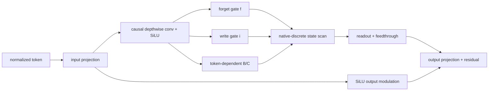

# Naju：独立控制保留与写入的原生离散 SSM

> **Fidelity: 核心机制复现**。真实执行 native-discrete selective recurrence 的完整 block；缩小模型与预训练预算。

## 论文信息

| 项目 | 内容 |
| --- | --- |
| 论文链接 | [arXiv 2607.21000](https://arxiv.org/abs/2607.21000) |
| 公司/机构 | Independent researchers |
| 首次公开日期 | 2026-07-23（arXiv v1） |
| 原文开源代码 | 否：论文未提供官方/作者代码（核查日期：2026-07-24） |
| Adapter | `naju` |
| 本地复现代码 | [`src/auto_research/reproductions/naju/`](https://github.com/daiwk/auto-research/tree/main/src/auto_research/reproductions/naju/) |

## 原始论文总结

### 背景与主要改动

Mamba 从连续时间系统离散化得到转移，单一耦合门也容易形成“强保留就难写入”的约束。Naju 直接参数化离散 pole，将 retain gate 和 write gate 分开，并保留 token-dependent $B/C$ 方向、短程因果卷积、直接 feedthrough 与输出调制。



### 核心公式

$$
x_n=f_n\odot x_{n-1}+i_n\odot(h_nB_n^\top),
\qquad f_n=\sigma(a_n),\quad i_n=\sigma(b_n),
$$

$$
y_n=\frac{1}{\sqrt{d_{\rm state}}}x_nC_n+D\odot h_n.
$$

实现采用论文 preserve-first 初始化：`forget_bias=5`、`write_bias=-2`。

### 论文离线与线上效果

论文同 1.2B-token WikiText-103 预算下 Naju PPL `26.20±0.17`，Mamba-2 `28.31±0.17`；长度 2048 的 retention/overwrite 诊断为 `0.99/0.89`。纯 LLM 论文不适用线上 A/B 门槛。

## 本地复现

> **本地对照口径**：基线为同 token、optimizer、70 steps 的 96-d、3-layer Transformer；Naju PPL 从 `324.930` 变为 `408.342`，相对 **`+25.67%`**（变差）。

训练后 retain/write 均值为 `0.993/0.125`，证明 preserve-first 门值被正确执行；但短预算 WikiText-2 没有迁移论文收益。稳定指标见 [`metrics/wikitext-2-seed42.json`](metrics/wikitext-2-seed42.json)。

```bash
auto-research reproduce --paper naju --dataset-dir data --seed 42
```

## 复现边界

Python sequential recurrence 与论文 affine scan 数学等价，但没有作者 fused parallel kernel。未复跑 1.2B-token WikiText-103、Mamba/Mamba-2/xLSTM 和完整 LRA/MQAR；本地负结果只适用于当前规模。
