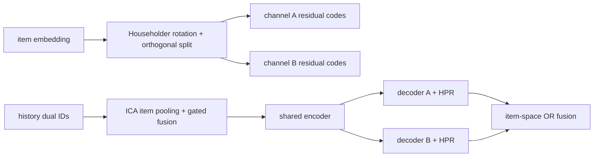

# BARGE：修复生成式推荐的 item 结构与语义漂移

> **Fidelity: 核心机制复现**。实际训练 OSQ 双语义路径、ICA、HPR、双 decoder 与 item-space OR-fusion；缩小公开数据与服务规模。

## 论文信息

| 项目 | 内容 |
| --- | --- |
| 论文链接 | [arXiv 2607.21028](https://arxiv.org/abs/2607.21028) |
| 公司/机构 | Tencent |
| 首次公开日期 | 2026-07-23（arXiv v1） |
| 原文开源代码 | 否：论文未提供官方/作者代码（核查日期：2026-07-24） |
| Adapter | `barge` |
| 本地复现代码 | [`src/auto_research/reproductions/barge/`](https://github.com/daiwk/auto-research/tree/main/src/auto_research/reproductions/barge/) |

## 原始论文总结

### 背景与主要改动

RQ-VAE 把一个 item 展成多个 Semantic-ID token 后，普通 Transformer 会丢失 item 边界；单量化路径还会让早期 beam 偏差逐层放大。BARGE 用 ICA 将同一 item 的 token 聚合后门控回写，用 HPR 对累计语义路径做逐层对比重排，并通过正交切分产生两条互补解码路径。



### 核心公式

ICA 先得到 item context，再门控回写：

$$
z^{(i)}=\operatorname{LN}(\operatorname{CrossAttn}(q,X^{(i)},X^{(i)})),
\qquad
\hat x_l^{(i)}=x_l^{(i)}+\sigma(W_g[x_l^{(i)}\Vert\hat z^{(i)}])\odot\hat z^{(i)}.
$$

HPR 用累计路径 $p^{(l)}=\sum_{j=1}^{l}e_{c_j}$ 与用户 context 做 symmetric InfoNCE；推理将生成 log-probability 与 reranker score 相加。DPD 约束 $R^\top R=I$，将 $Rz$ 切成两个正交子空间并分别量化。

### 论文离线与线上效果

论文在 Amazon Beauty、Sports、Toys、Yelp 和腾讯离线数据上均报告提升。腾讯线上 A/B：CTR `+0.60%`、点击 UV `+1.34%`、总阅读时长 `+1.70%`。

## 本地复现

> **本地对照口径**：基线是同 width、层数、训练行、optimizer 和 140 steps 的 single-path RQ-VAE/TIGER；实验组增加 OSQ、ICA、HPR 和 DPD，NDCG@10 从 `0.01147` 到 `0.02131`，相对 **`+85.77%`**。

MovieLens-100K 的 180 users / 300 items 上，Hit@10 `+60.00%`，但 head share 同时 `+165.02%`，因此不能把精度提升解读成无代价收益。OSQ 重建 loss 从 `0.05969` 降至 `0.01947`，正交误差 `2.98e-7`。稳定指标见 [`metrics/movielens-100k-seed42.json`](metrics/movielens-100k-seed42.json)。

```bash
auto-research reproduce --paper barge --dataset-dir data --seed 42
```

## 复现边界

MovieLens genre 替代腾讯 item embedding；全库 teacher-forced path scoring 替代生产 beam kernel，未使用私有曝光负例和线上 serving。OSQ、ICA、HPR、DPD 均真实训练，但本地百分比不对应论文线上 lift。
