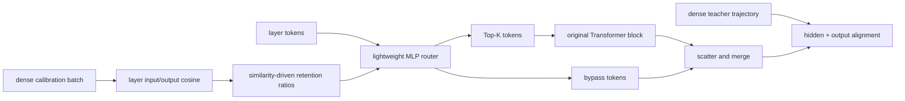

# AdaDSF：按层相似度分配动态深度计算

> **Fidelity: 核心机制复现**。真实执行 dense calibration、逐层 token budget 分配、Top-K router 和特征对齐；缩小模型与训练预算。

## 论文信息

| 项目 | 内容 |
| --- | --- |
| 论文链接 | [arXiv 2607.21291](https://arxiv.org/abs/2607.21291) |
| 公司/机构 | Huawei ACS Lab / Southern University of Science and Technology |
| 首次公开日期 | 2026-07-23（arXiv v1） |
| 原文开源代码 | 否：论文未提供官方/作者代码（核查日期：2026-07-28） |
| Adapter | `adadsf` |
| 本地复现代码 | [`src/auto_research/reproductions/adadsf/`](https://github.com/daiwk/auto-research/tree/main/src/auto_research/reproductions/adadsf/) |

## 原始论文总结

### 背景与主要改动

固定比例的 Mixture-of-Depths 会给每一层相同 token budget，但不同层对表示的改写强度并不相同。AdaDSF 先在 dense teacher 上测量各层输入/输出 cosine similarity，再把更多计算分给变化更大的层；每层 MLP router 只把 Top-K token 送入原 Transformer block，其他 token 走 residual bypass。最后同时对齐中间 hidden states 和输出分布。



### 核心公式

层变换相似度及温度归一化权重：

$$
s_i=\frac{x_{\mathrm{in}}^{(i)}\cdot x_{\mathrm{out}}^{(i)}}
{\lVert x_{\mathrm{in}}^{(i)}\rVert\lVert x_{\mathrm{out}}^{(i)}\rVert},
\qquad
w_i=\frac{\exp((s_i-\max_j s_j)/\tau)}
{\sum_j\exp((s_j-\max_k s_k)/\tau)}.
$$

论文把 $w_i$ 映射到有界 ratio，并校正到全局预算 $t$：

$$
z_i=\beta\left(\frac{1}{L}\sum_j w_j-w_i\right),\quad
r'_i=0.05+0.9\sigma(z_i),\quad
r_i=\frac{tL}{\sum_j r'_j}r'_i.
$$

对齐目标为：

$$
\mathcal L=\mathrm{KL}(P_{\rm dense}\Vert P_{\rm sparse})
+\frac1L\sum_l
\left\|\operatorname{softmax}(h_{\rm sparse}^{(l)})
-\operatorname{softmax}(h_{\rm dense}^{(l)})\right\|_2.
$$

### 论文离线与线上效果

GPT-NeoX-130M 在 WikiText-103 的 dense PPL 为 `17.9`。80% retention 时，MoD 为 `21.6`，AdaDSF 为 `18.9`，normalized FLOPs 为 `0.787`。Qwen2.5-0.5B 六项 commonsense 平均分从 dense `51.7` 变为 AdaDSF `49.1`，优于同 FLOPs 的 MoD `44.4`。纯 LLM 论文不适用线上 A/B 门槛。

## 本地复现

> **本地对照口径**：基线为同一个 96-d、4-layer dense teacher；Uniform MoD 实验组与 AdaDSF 实验组共享 80% token budget、teacher checkpoint、35 alignment steps 和 optimizer。AdaDSF PPL `321.933`，相对 Uniform MoD 的 `320.969` **高 0.30%（变差）**；相对 dense teacher 的 `318.717` 高 `1.01%`。

calibration 得到四层 cosine similarity `[0.560, 0.749, 0.793, 0.928]`，由论文公式分配 retention `[1.0, 1.0, 1.0, 0.2]`，实际平均 active-token fraction 为 `0.7995`。当前小模型负结果不支持“自适应预算必然优于均匀预算”的结论。稳定指标见 [`metrics/wikitext-2-seed42.json`](metrics/wikitext-2-seed42.json)。

```bash
auto-research reproduce --paper adadsf --dataset-dir data --device mps --seed 42
```

AdaDSF 也已作为 `micro-llm` evolve 的可执行结构研究阶段接入：它会先训练 dense checkpoint，再进行 calibration 和 sparse alignment。

## 复现边界

未下载 GPT-NeoX-130M/Qwen2.5 和 WikiText-103，而是在本地 WikiText-2 微型 decoder 上验证算法链路；normalized active-token fraction 不是 GPU kernel 的实测 FLOPs。Top-K block 确实只处理选中 token，不是输出后 masking，但没有论文大模型 kernel 优化与六项完整 commonsense 评测。
