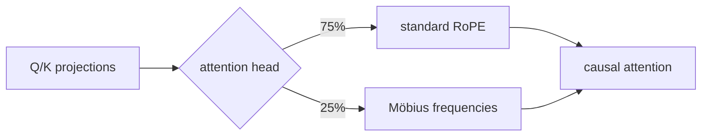

# Möbius RoPE：用反周期边界提高长距检索稳定性

> **Fidelity: 核心机制复现**。真实训练 standard RoPE 与 25% heads Möbius RoPE；缩小模型、语料和随机种子规模。

## 论文信息

| 项目 | 内容 |
| --- | --- |
| 论文链接 | [arXiv 2607.21405](https://arxiv.org/abs/2607.21405) |
| 公司/机构 | Independent researcher |
| 首次公开日期 | 2026-07-23（arXiv v1） |
| 原文开源代码 | 否：论文称实验归档，但未提供可核验的官方/作者代码链接（核查日期：2026-07-24） |
| Adapter | `mobius-rope` |
| 本地复现代码 | [`src/auto_research/reproductions/mobius_rope/`](https://github.com/daiwk/auto-research/tree/main/src/auto_research/reproductions/mobius_rope/) |

## 原始论文总结

### 背景与主要改动

标准 RoPE 的随机种子会显著影响长距离 needle retrieval。论文为部分 attention heads 使用反周期频率梯度，使跨完整训练窗口的旋转恒为 $-I$；其余 heads 保留标准 RoPE，以维持语言建模能力。



### 核心公式

固定训练上下文 $N$，每个二维旋转平面使用：

$$
\theta_i=\frac{\pi(2i+1)}{N},\qquad
R(N)=-I,\qquad R(2N)=I.
$$

本地实现固定 `N=64`，四个 heads 中一个使用该频率表。

### 论文离线与线上效果

48 个 160M/410M 训练 run、每个 2B FineWeb-Edu tokens。160M hybrid PPL `29.66`，standard `29.72`；context 512 的单针检索为 `90.3±5.7%` 对 `63.3±31.4%`。纯 LLM 论文不适用线上 A/B 门槛。

## 本地复现

> **本地对照口径**：基线为 standard RoPE；实验组使用同一 96-d、3-layer 初始化、WikiText-2/单针 curriculum 和 90 steps，仅替换 25% attention heads；Möbius PPL 从 `291.000` 降到 `290.922`，相对 **`-0.03%`**，但 needle accuracy 从 `97.40%` 降到 `95.31%`，相对变化按百分点为 **`-2.08`**。

小模型单 seed 没有复现论文的 retrieval 稳定性提升，不能据此宣称该方法在短预算必然有效。稳定指标见 [`metrics/wikitext-2-needle-seed42.json`](metrics/wikitext-2-needle-seed42.json)。

```bash
auto-research reproduce --paper mobius-rope --dataset-dir data --seed 42
```

## 复现边界

未运行 48 个大模型、2B tokens/run 和六 seed 方差检验；本地 needle task 是可审计的机制验证，且两组都接受相同 retrieval curriculum。
