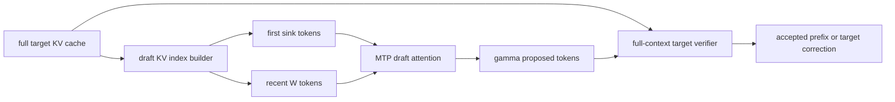

# Windowed-MTP：只给 draft 保留 sink 与最近窗口

> **Fidelity: 核心机制复现**。真实训练 MTP draft、切换 KV key 集并执行 target verification；缩小模型、context 和 serving runtime。

## 论文信息

| 项目 | 内容 |
| --- | --- |
| 论文链接 | [arXiv 2607.21535](https://arxiv.org/abs/2607.21535) |
| 公司/机构 | NVIDIA |
| 首次公开日期 | 2026-07-23（arXiv v1） |
| 原文开源代码 | 是：[avalliappan-nvidia/windowed-mtp-b200](https://github.com/avalliappan-nvidia/windowed-mtp-b200) |
| Adapter | `windowed-mtp` |
| 本地复现代码 | [`src/auto_research/reproductions/windowed_mtp/`](https://github.com/daiwk/auto-research/tree/main/src/auto_research/reproductions/windowed_mtp/) |

## 原始论文总结

### 背景与主要改动

内置 MTP/NEXTN draft 通常每提出一个 token 都读取完整 KV cache；在百万 token 上，即使 target 已使用 GDN/Mamba 等便宜 verifier，draft 的全量 KV read 仍会成为瓶颈。Windowed-MTP 只改变 draft：保留最前面的 attention sink 与最近 $W$ 个 token，同时 target 继续读取完整上下文并验证所有候选。因此窗口只影响接受率和速度，不改变 target 决定的输出分布。



### 核心公式

一次 speculative step 的成本：

$$
\mathrm{step}=t_{\mathrm{verify}}+t_{\mathrm{draft}},\qquad
t_{\mathrm{draft}}=t_{\mathrm{draft}}^{\mathrm{ctx}}
+\gamma t_{\mathrm{draft}}^{\mathrm{fwd}},\qquad
\mathrm{TPOT}=\frac{\mathrm{step}}{\mathrm{AL}}.
$$

Windowed-MTP 把 draft 的 key set 从 $S$ 限制到 $n_{\rm sink}+W$：

$$
\mathcal K_{\rm draft}
=\{0,\ldots,n_{\rm sink}-1\}
\cup\{S-W,\ldots,S-1\},
$$

而 verifier 仍使用完整 $\mathcal K_{\rm target}=\{0,\ldots,S-1\}$。故 draft 分布 $q$ 可以变化，但 target 分布 $p(\cdot\mid x_{<t})$ 和最终输出不变。

### 论文离线与线上效果

在单张 B200、1M context、$d=7$ 下，每步耗时从 `26.4→18.3 ms`（Qwen3.6-35B，`+44.3%`）、`34.5→26.5 ms`（Qwen3.5-122B，`+30.2%`）、`33.1→25.8 ms`（Nemotron-3-120B，`+28.3%`）。draft KV 占总 KV 的 `7.7–11.1%`，ring buffer 可回收其中未读部分。纯 LLM serving 论文不适用线上 A/B 门槛。

## 本地复现

> **本地对照口径**：基线为读取完整历史的同权重 MTP draft；实验组只把 draft key set 改为 `8 sink + 64 recent`，target、词表、draft 权重和验证规则完全相同。16K context 的 KV read 从 `16384` 个 key 降到 `72` 个，**减少 99.56%**；Apple MPS 上 draft attention 从 `1.0413 ms` 降到 `0.5180 ms`，**降低 50.25%**。

24-token greedy generation 中，native 和 windowed speculative decoding 都与 dense target 完全一致。小模型 acceptance rate 从 `41.67%` 降到 `25.00%`，说明“输出无损”不等于“接受率不变”；本地延迟收益来自更少的 KV read。稳定指标见 [`metrics/wikitext-2-seed42.json`](metrics/wikitext-2-seed42.json)。

```bash
auto-research reproduce --paper windowed-mtp --dataset-dir data --device mps --seed 42
```

## 复现边界

本地实现训练了共享 target token embedding 的轻量 MTP head，并实际执行 sink+window attention 和逐 token target verification；没有复刻 SGLang paged-KV/Triton ring buffer、连续 batching、B200/H100 或百万 token 测试。因此本地 MPS latency 只验证复杂度趋势，不能与论文生产硬件数字直接比较。
