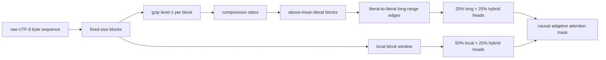
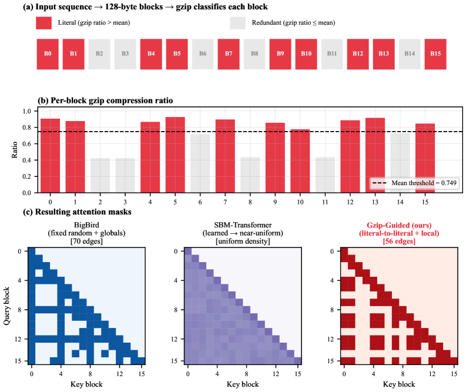

# Gzip-guided Sparse Attention：用压缩率选择长程内容

> **Fidelity: 核心机制复现**。真实逐块执行 gzip、生成样本自适应 mask 并训练同参数 ByteLM；缩小 context、模型和训练步数。

## 论文信息

| 项目 | 内容 |
| --- | --- |
| 论文链接 | [arXiv 2607.21752](https://arxiv.org/abs/2607.21752) |
| 公司/机构 | Pennsylvania State University |
| 首次公开日期 | 2026-07-23（arXiv v1） |
| 原文开源代码 | 否：论文未提供官方/作者代码（核查日期：2026-07-28） |
| Adapter | `gzip-sparse-attention` |
| 本地复现代码 | [`src/auto_research/reproductions/gzip_sparse_attention/`](https://github.com/daiwk/auto-research/tree/main/src/auto_research/reproductions/gzip_sparse_attention/) |

## 原始论文总结

### 背景与主要改动

固定 BigBird/Longformer mask 不理解内容，learned mask 又需要额外参数、梯度估计或专用 kernel。论文把字节序列切成固定 block，用 gzip 压缩率作为无需训练的信息密度信号：高于样本均值的 literal blocks 互相建立长程连接，所有 block 保留局部窗口，不设置固定 global token。50% heads 只看 local、25% 只看 literal long-range、25% 使用两者并集。



<!-- paper-figure:start -->
### 原论文关键图

[](https://arxiv.org/html/2607.21752v1/x1.png)

> **原论文 Figure 1（关键图）**：展示原论文方法的总体设计和关键组成。图片来自[原论文](https://arxiv.org/abs/2607.21752)，版权归原作者所有；点击图片可查看来源。
<!-- paper-figure:end -->

### 核心公式

第 $i$ 个 block 的压缩率和无需超参数的 literal 标记为：

$$
r_i=\frac{|\operatorname{gzip}(x_{ib:(i+1)b})|}{b},
\qquad
\ell_i=\mathbb 1[r_i>\bar r],
\qquad
\bar r=\frac1B\sum_{j=1}^{B}r_j.
$$

最终 block mask 联合 literal 长程、局部窗口和自连接，再与 causal mask 相交：

$$
M=M^{\mathrm{lit}}\cup M^{\mathrm{local}}\cup I,\qquad
M^{\mathrm{lit}}_{ij}=\mathbb 1[\ell_i=\ell_j=1],\qquad
M^{\mathrm{local}}_{ij}=\mathbb 1[|i-j|\le w].
$$

若 literal block 数为 $L$，attention edge 复杂度为：

$$
O(L^2+Nw),
$$

当 $L=O(\sqrt N)$ 时随序列长度近似线性。

### 论文离线与线上效果

论文在 PG-19、92M 参数、8K bytes、20K steps 上报告 Gzip-Guided `1.71 BPB`，优于 Dense `2.89`、BigBird `2.34`、Longformer `3.21` 和 SBM-Transformer `3.38`。达到 `2.5 BPB` 所需步数相对 BigBird 加速 `3.3×`；从 4K 扩展到 8K 时，对 BigBird 的 BPB 优势从 `0.05` 扩大到 `0.63`。纯 LLM 论文不适用线上 A/B 门槛。

## 本地复现

> **本地对照口径**：基线为相同 132,032 参数、相同初始化、WikiText-2 原始 bytes、256 context 和 120 steps 的 BigBird fixed mask；实验组只替换为逐样本 gzip mask。实验组 BPB `5.1129`，相对 BigBird `5.0614` **高 1.02%（变差）**；相对 Dense `5.0819` 高 `0.61%`。

样例 gzip mask 相对 dense causal attention 减少 `70.82%` edges，但 256-byte context 和 120 steps 未迁移论文在 8K/20K steps 后才出现的训练收益。稳定指标见 [`metrics/wikitext-2-byte-seed42.json`](metrics/wikitext-2-byte-seed42.json)。

```bash
auto-research reproduce --paper gzip-sparse-attention --dataset-dir data --device mps --seed 42
```

## 复现边界

本地实现确实逐样本调用 gzip 并执行三类 head mask，但 PyTorch 仍计算 dense score matrix 后 masking，所以 edge 数下降不等于 wall-clock 加速。没有下载 28,602 本 PG-19、训练 92M 模型或使用 8K context；小预算负结果不能反驳论文的长上下文训练结论。
