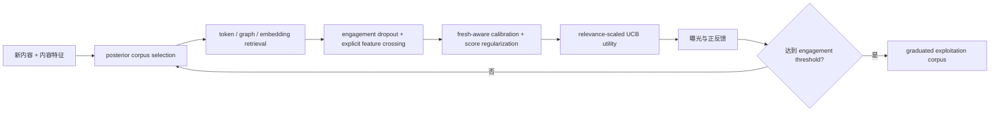

# PinEqualizer：Pinterest 全漏斗冷启动探索与去偏

> **Fidelity: 核心机制复现**。真实执行 engagement dropout、内容交叉、分 cohort calibration、探索 corpus 与 relevance-scaled UCB；私有多阶段系统由公开代理缩小。

## 论文信息

| 项目 | 内容 |
| --- | --- |
| 论文链接 | [arXiv 2607.22518](https://arxiv.org/abs/2607.22518) |
| 公司/机构 | Pinterest |
| 首次公开日期 | 2026-07-23（arXiv v1） |
| 原文开源代码 | 否：论文未提供官方/作者代码（核查日期：2026-07-28） |
| Adapter | `pinequalizer` |
| 本地复现代码 | [`src/auto_research/reproductions/pinequalizer/`](https://github.com/daiwk/auto-research/tree/main/src/auto_research/reproductions/pinequalizer/) |

## 原始论文总结

### 背景与主要改动

新内容缺少协同图和历史互动，生产模型又会依赖已有曝光形成反馈回路。PinEqualizer 不把问题限制在一个排序模型，而是在 corpus selection、召回、精排和 utility 每一级检查 fresh 内容的输入占比与存活率。模型侧加入纯内容/VLM/SID 特征、逐 engagement 特征 dropout、内容—年龄—互动显式交叉、分内容类型 calibration 和 fresh/old 分数正则；探索侧维护独立 corpus，并用 Thompson posterior、实时 impression UCB 或 Neural Linear UCB 分配流量。



### 核心公式

用模型先验 $\alpha$、先验强度 $N$、历史正反馈 $e$ 和曝光 $n$ 估计探索内容价值：

$$
\hat r_i=\frac{\alpha_iN+e_i}{N+n_i}.
$$

实时曝光越少，探索 bonus 越大；搜索场景再用相关性抑制不相关探索：

$$
\mathrm{UCB}_i=\frac{\alpha}{\sqrt{1+\beta\,\mathrm{impressions}_i}},
\qquad
\mathrm{UCB}'_i=\mathrm{relevance}_i^\gamma\mathrm{UCB}_i.
$$

Neural Linear UCB 使用主模型隐藏向量 $\phi(x)$：

$$
\hat y_i=\phi(x_i)^\top\theta+
\alpha\sqrt{\phi(x_i)^\top\Sigma\phi(x_i)},\qquad
\Sigma=\left(\sum_i\phi(x_i)\phi(x_i)^\top+\lambda I\right)^{-1}.
$$

### 论文离线与线上效果

系统自 2024 年起逐步上线，使 fresh-content impressions 累计增长 `350%`。长期 A/B holdout 中，underexplored engagement volume 在 Homefeed/Search/Related Pins 分别累计 `+37%/+13%/+27%`。Related Pins 组件级 A/B 中，ranking architecture 对 all-fresh engagement 为 `+8.63%`、对 underexplored engagement 为 `+6.57%`；ranking feature improvements 分别为 `+5.57%/+18.52%`。28 天毕业内容 corpus 同比 `+41%`，成功内容提供者数量同比 `+99%`。

## 本地复现

> **本地对照口径**：基线和实验组都使用 MovieLens-1M、相同 user/content 输入、100 steps、seeds 42/43/44 和独立 test；实验组增加论文的 individual engagement dropout、content×age/engagement crossing、fresh/old score regularization、分 cohort Platt calibration 与 validation-only UCB 选择。实验组整体 NDCG@10 相对基线 **-16.44%（变差）**，fresh NDCG@10 **+448.62%**，underexplored exposure@10 **+471.02%**。

三组 validation 都选择 `UCB alpha=0`，说明当前去偏模型已把 fresh 流量推得很高，额外 UCB 只会恶化验证目标。该结果展示的是明显的整体精度—探索 trade-off，不能只报告 fresh 指标。稳定指标见 [`metrics/movielens-1m-seed42-44.json`](metrics/movielens-1m-seed42-44.json)。

```bash
auto-research reproduce --paper pinequalizer --dataset-dir data --device mps --seed 42
```

## 复现边界

MovieLens 的物品首见时间只是新内容代理：fresh 定义为首见时间最新 20%，underexplored 再限制为低于 fresh popularity 中位数。实现没有 Pinterest 的 PinCLIP、SID、商家数据、三大 surface、长期内容 holdout 和实时 Flink 特征；因此只验证算法链路和公开数据 trade-off，不把本地 NDCG 外推为线上 engagement。
