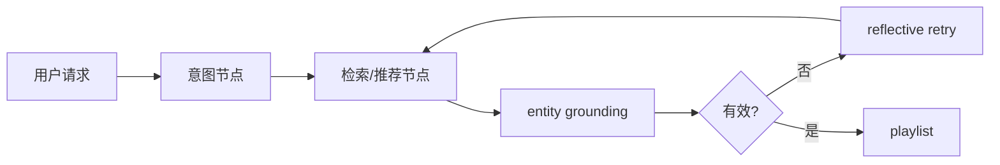
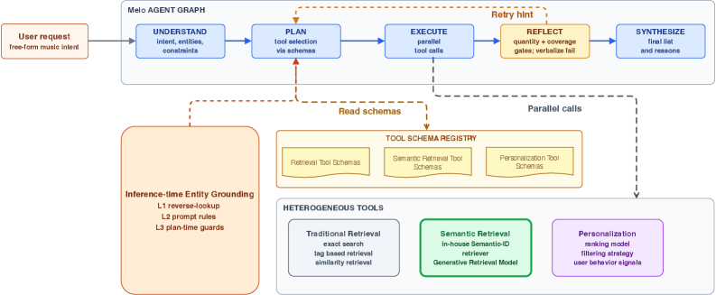

# Melo：生产级 LLM 音乐推荐 Agent

> **Fidelity: 核心机制复现**。本地执行意图路由、grounded 检索与失败反思重试；不把公开代理环境冒充网易云音乐生产系统。

## 论文信息

| 项目 | 内容 |
| --- | --- |
| 论文链接 | [arXiv 2607.23718](https://arxiv.org/abs/2607.23718) |
| 公司/机构 | NetEase Cloud Music / Zhejiang University of Technology |
| 首次公开日期 | 2026-07-26（arXiv v1） |
| 原文开源代码 | 否：论文未提供官方/作者代码（核查日期：2026-08-09） |
| Adapter | `melo` |
| 本地复现代码 | [`src/auto_research/reproductions/melo/`](https://github.com/daiwk/auto-research/tree/main/src/auto_research/reproductions/melo/) |

## 原始论文总结

### 背景与主要改动

用多节点 Agent 编排意图、检索、推荐与解释，以实体目录 grounding 阻止幻觉，并在失败时触发反思重试。



<!-- paper-figure:start -->
### 原论文关键图

[](https://arxiv.org/html/2607.23718v1/x2.png)

> **原论文 Figure 2（关键图）**：展示原论文方法的总体设计和关键组成。图片来自[原论文](https://arxiv.org/abs/2607.23718)，版权归原作者所有；点击图片可查看来源。
<!-- paper-figure:end -->

### 核心公式

$$
\hat e=\arg\max_{e\in\mathcal E}s(q,e),\quad \text{retry}=\mathbf1[\hat e\notin\mathcal E\ \lor\ score<\tau].
$$

### 论文离线与线上效果

约百万用户、2026-04-02 至 05-10 的系统级 A/B 报告 playlist retention 提升超过 2pp；该数值包含 Muse Mix 产品/UI 整体影响。

## 本地复现

> **本地对照口径**：基线为无运行时修复的 catalog recommender，实验组为 grounding + retry；Hit@10 -20.00%、NDCG@10 -8.16%，fresh Hit@10 +50.00%。

MovieLens 目录执行 entity grounding、候选校验和一次 reflective retry，记录错误修复路径。

```bash
auto-research reproduce --paper melo --data-root data --seed 42
```

稳定结果见 [`result-seed42.json`](metrics/result-seed42.json)。

## 复现边界

无法隔离论文系统 A/B 中模型、产品面和 UI 的贡献，论文也未给置信区间；本站明确保留该归因限制。
