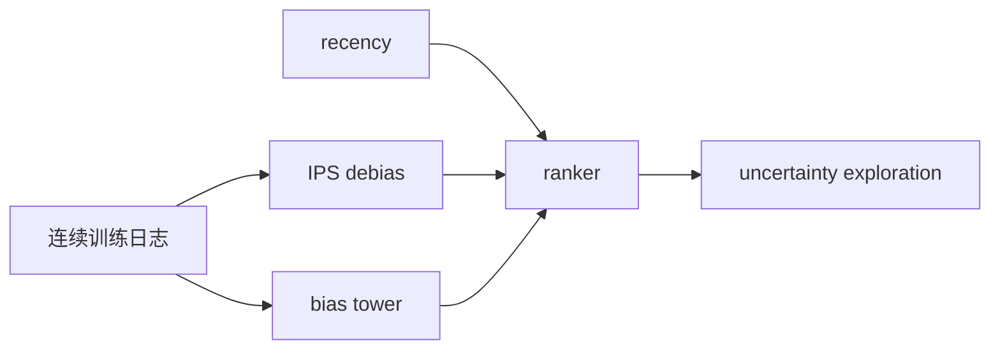
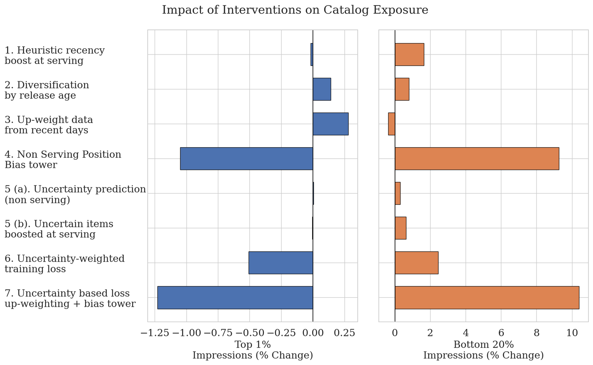

# YouTube Music：打破新颖性与新鲜度反馈环

## 论文信息

| 字段 | 内容 |
|---|---|
| 论文链接 | [arXiv 2607.23749](https://arxiv.org/abs/2607.23749) |
| 公司/机构 | YouTube Music / Google |
| 首次公开日期 | 2026-07-26（arXiv v1） |
| 原文开源代码 | 否：截至 2026-07-29 未发现官方公开仓库 |
| Adapter | `youtube-freshness` |
| 本地复现代码 | [`src/auto_research/reproductions/youtube_freshness/`](https://github.com/daiwk/auto-research/tree/main/src/auto_research/reproductions/youtube_freshness/) |

## 原始论文总结

### 背景与主要改动

系统比较 recency feature、IPS、可移除 bias tower 与 SNGP 不确定性探索，区分训练去偏和 serving 探索。



<!-- paper-figure:start -->
### 原论文关键图

[](https://arxiv.org/html/2607.23749v1/popularity_bias_imp_vertical.png)

> **原论文 Figure 2（关键图）**：展示原论文方法的总体设计和关键组成。图片来自[原论文](https://arxiv.org/abs/2607.23749)，版权归原作者所有；点击图片可查看来源。
<!-- paper-figure:end -->

### 核心公式

$$
\mathcal L_{\mathrm{IPS}}=-\frac{y}{\max(p_{\mathrm{log}},\epsilon)}\log\hat y,\quad score=\mu(x)+\beta\sigma(x).
$$

### 论文离线与线上效果

两周、每臂每日数百万用户的六项 A/B；不确定性损失让 1-day new-release engagement +4.33%。

## 本地复现

> **本地对照口径**：基线为 popularity-biased continuous ranker，实验组为四机制组合；Hit@10 +0.00%、NDCG@10 -6.35%，head share -28.72%。

MovieLens 上执行 recency、IPS、训练期 bias tower/serving 移除和距离不确定性加分。

```bash
auto-research reproduce --paper youtube-freshness --data-root data --seed 42
```

稳定结果见 [`result-seed42.json`](metrics/result-seed42.json)。

## 复现边界

没有 YouTube 连续训练基础设施和 SNGP 大模型；本地负结果不推翻论文各干预的在线结论。
