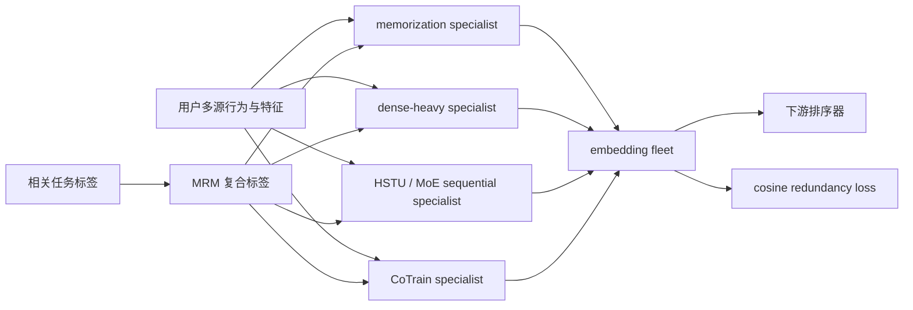
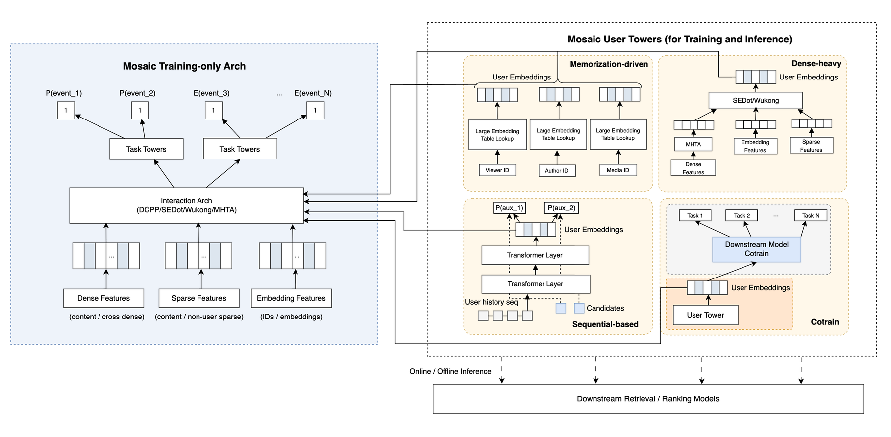

# Mosaic：用 specialist fleet 扩展用户表征

> **Fidelity: 核心机制复现**。实际训练四类 specialist、MRM 复合任务和 cosine redundancy loss；缩小数据、序列长度和 serving 链路。

## 论文信息

| 项目 | 内容 |
| --- | --- |
| 论文链接 | [arXiv 2607.24015](https://arxiv.org/abs/2607.24015) |
| 公司/机构 | Meta |
| 首次公开日期 | 2026-07-27（arXiv v1） |
| 原文开源代码 | 否：论文未提供官方/作者代码（核查日期：2026-07-28） |
| Adapter | `mosaic` |
| 本地复现代码 | [`src/auto_research/reproductions/mosaic/`](https://github.com/daiwk/auto-research/tree/main/src/auto_research/reproductions/mosaic/) |

## 原始论文总结

### 背景与主要改动

单个通用 user embedding 很难同时覆盖长期记忆、稠密特征、长序列兴趣和特定下游任务。Mosaic 把用户表征组织成可独立演进的 specialist fleet：memorization-driven、dense-heavy、sequential HSTU+MoE 和与下游任务联合训练的 CoTrain。下游排序器按需消费多个 embedding，而不是让一个网络承担所有目标。

随着 fleet 增大，新 embedding 容易复制旧 embedding 的信息。论文用 Multi-Task Relation Mining（MRM）把高度相关任务的二元标签做笛卡尔积，显式学习联合行为；同时用 cosine redundancy loss 把新 specialist 推向旧表征的正交子空间。



<!-- paper-figure:start -->
### 原论文关键图

[](https://arxiv.org/html/2607.24015v1/sections/figures/model_arch.png)

> **原论文 Figure 2（关键图）**：展示原论文提出的核心架构、主要模块及其连接关系。图片来自[原论文](https://arxiv.org/abs/2607.24015)，版权归原作者所有；点击图片可查看来源。
<!-- paper-figure:end -->

### 核心公式

对任务标签做 Spearman 相关性挖掘：

$$
\rho_{ij}=
\frac{\operatorname{cov}(\operatorname{rg}(\mathbf y_i),
\operatorname{rg}(\mathbf y_j))}
{\sigma_{\operatorname{rg}(\mathbf y_i)}
\sigma_{\operatorname{rg}(\mathbf y_j)}}.
$$

对同一相关任务组 $\mathcal C_g$ 构造联合标签
$\ell_n^{(\mathcal C_g)}=(y_{g_1,n},\ldots,y_{g_m,n})$。新 specialist 与 $K$ 个已部署 embedding 的去冗余目标为：

$$
\mathcal L_{\mathrm{red}}
=\frac1K\sum_{k=1}^K
\frac{\mathbf e^{(\mathrm{new})}\cdot\mathbf e_k^{(\mathrm{old})}}
{\|\mathbf e^{(\mathrm{new})}\|\,\|\mathbf e_k^{(\mathrm{old})}\|},
\qquad
\mathcal L=\mathcal L_{\mathrm{main}}+\lambda(t)\mathcal L_{\mathrm{red}},
$$

其中 $\lambda(t)$ 先 warm up，避免主任务尚未收敛时被正交约束主导。

### 论文离线与线上效果

论文的 sequential specialist 从 512 扩到 1024/2048 序列时，Eval $\Delta$NE 分别为 `-0.21%/-0.45%`；MoE 和 256-d embedding 继续带来 `-0.07%` 到 `-0.25%` 的 NE 改善。CoEval 把 embedding 迭代速度提高 `3–5×`。线上三个产品 surface 的 topline 指标分别提升 `+0.10%`、`+0.15%`、`+0.28%`，均统计显著。AOTI、model split 与 memcache 累计降低 `79%` GPU serving usage。

## 本地复现

> **本地对照口径**：基线是同一 MovieLens-1M 切分、同一 full-catalog 候选集上的单 GRU sequential embedding；实验组训练 memorization、dense-heavy、sequential、CoTrain-MoE 四 specialist，并加入 MRM 与 warm-up CRL。NDCG@10 相对基线 **+3.49%**，Hit@10 **-7.69%**。

| Variant | Hit@10 | NDCG@10 | Head share@10 |
| --- | ---: | ---: | ---: |
| 单 sequential embedding | 0.0406 | 0.0164 | 0.1347 |
| Mosaic fleet + MRM + CRL | 0.0375 | 0.0170 | 0.1553 |

CRL 末段平均 cosine redundancy 为 `-0.1508`，说明 specialist 确实被推向不同子空间；但 head share 上升 `15.31%`，本地收益伴随更强头部偏置。完整稳定指标见 [`metrics/movielens-1m-seed42.json`](metrics/movielens-1m-seed42.json)。

```bash
auto-research reproduce --paper mosaic --dataset-dir data --device mps --seed 42
```

## 复现边界

MovieLens genre/popularity 代理 Meta 的多表面私有行为标签；本地 sequential specialist 是 GRU 而非 2048-token HSTU，CoTrain 也缩为小型 routed MoE。未复刻跨产品特征、CoEval、User Tower Zero-Out、AOTI、memcache 和线上混合 CPU/GPU serving，不能把本地 `+3.49%` 与论文线上 lift 直接比较。
