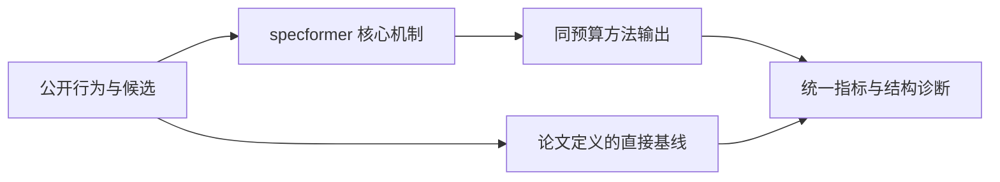
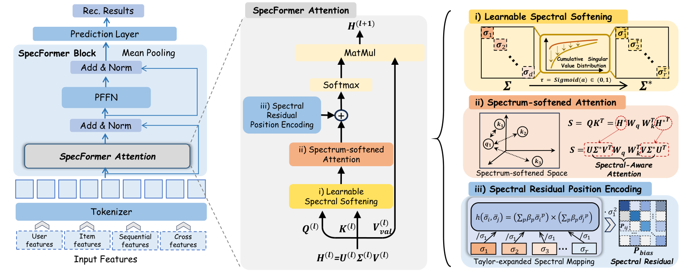

# SpecFormer：谱感知 Transformer 缓解表征坍缩

> **Fidelity: 核心机制复现**。本地代码执行论文最有辨识度、可由公开数据验证的机制；私有数据、生产模型与服务栈明确列为边界。

## 论文信息

| 项目 | 内容 |
| --- | --- |
| 论文链接 | [arXiv 2607.24025](https://arxiv.org/abs/2607.24025) |
| 公司/机构 | Zhejiang University（按第一作者所属机构聚合） |
| 首次公开日期 | 2026-07-27（arXiv v1） |
| 原文开源代码 | 是：[istarryn/SpecFormer](https://github.com/istarryn/SpecFormer) |
| Adapter | `specformer` |
| 本地复现代码 | [`src/auto_research/reproductions/specformer/`](https://github.com/daiwk/auto-research/tree/main/src/auto_research/reproductions/specformer/) |

## 原始论文总结

### 背景与主要改动

以奇异值谱软化和谱残差位置编码，抑制推荐 Transformer 的 embedding/attention collapse。



<!-- paper-figure:start -->
### 原论文关键图

[](https://arxiv.org/html/2607.24025v2/method.png)

> **原论文 Figure 4（关键图）**：展示原论文提出的核心架构、主要模块及其连接关系。图片来自[原论文](https://arxiv.org/abs/2607.24025)，版权归原作者所有；点击图片可查看来源。
<!-- paper-figure:end -->

### 核心公式

$$
\\tilde X=U\\sqrt{\\Sigma}V^\\top,\\qquad A=\\operatorname{softmax}(QK^\\top/\\sqrt d+R_{spec}).
$$

### 论文离线与线上效果

- Alibaba 电商广告 10 天 10% 流量，CTR +1.34%、CVR +15.97%、订单 +16.72%（10 天、10% 流量，p<0.05）。
- 上述数字只复述论文线上证据，不写入本地公开数据效果结论。

## 本地复现

> **本地对照口径**：同一全目录协议下，基线 NDCG@10 为 `0.05401`，实验组 SpecFormer 为 `0.04999`，相对变化 **-7.44%**。这是公开代理任务的负结果，生产线上 lift 的外推不适用。

三随机种子完整结果、均值、标准差与 95% CI：

- [`metrics/public-seeds42-44.json`](metrics/public-seeds42-44.json)

```bash
auto-research reproduce --paper specformer --dataset-dir data --seed 42
```

## 复现边界

本地使用 MovieLens-1M 的公开子集及可审计代理目标，不能复现论文公司的私有日志、线上分桶、生产模型规模和 serving 栈。因此本页只解释为核心机制级验证，不宣称复现原文绝对指标或线上增益。
