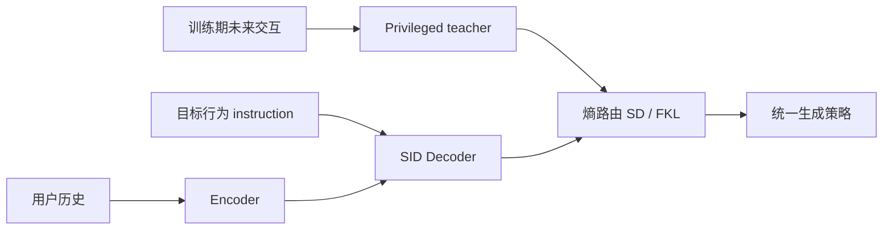
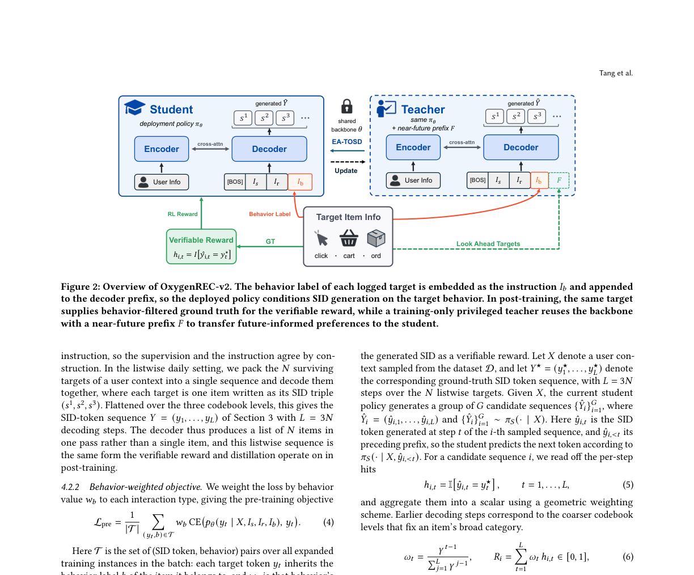

# OxygenREC-v2

> **Fidelity: 核心机制复现**。实际训练行为 instruction、行为加权目标、未来交互 privileged view 与熵路由蒸馏；生产模型和私有漏斗数据未复刻。

## 论文信息

| 项目 | 内容 |
| --- | --- |
| 论文链接 | [arXiv 2607.24255](https://arxiv.org/abs/2607.24255) |
| 公司/机构 | JD.COM |
| 首次公开日期 | 2026-07-27（arXiv v1） |
| 原文开源代码 | 否：论文未提供官方/作者代码（核查日期：2026-08-09） |
| Adapter | `oxygenrec-v2` |
| 本地复现代码 | [`src/auto_research/reproductions/oxygenrec_v2/`](https://github.com/daiwk/auto-research/tree/main/src/auto_research/reproductions/oxygenrec_v2/) |

## 原始论文总结

### 背景与主要改动

工业生成式推荐通常先生成候选，再外挂判别器或 reward model 重排；重排只能改变顺序，
不能补回生成阶段漏掉的商品。OxygenREC-v2 把 click/cart/order 行为作为 decoder
instruction，从第一枚 SID token 起控制候选生成；后训练再使用仅训练期可见的未来交互，
联合可验证轨迹优化、自蒸馏和高熵位置的 forward-KL。



<!-- paper-figure:start -->
### 原论文关键图

[](https://arxiv.org/abs/2607.24255)

图片来自[原论文](https://arxiv.org/abs/2607.24255)，版权归原作者所有；点击图片可查看来源。
<!-- paper-figure:end -->

### 核心公式

行为指令进入 decoder prefix，预训练用行为权重 $w_b$ 调整生成损失。后训练目标可概括为：

$$
\mathcal L=\mathcal L_{\mathrm{VR}}
+\lambda\mathcal L_{\mathrm{SD}}
+\beta\mathcal L_{\mathrm{FKL}},
$$

其中低熵位置接受 privileged teacher 的稠密自蒸馏，高熵位置用 forward-KL 保留不确定性，
而 teacher 的未来交互前缀不会进入线上推理。

### 论文离线与线上效果

- 同一 backbone 下，HR@512 从 43.24% 升至 44.14%，Recall@512 从 34.95% 升至 36.39%。
- 京东六个生产场景、5%–20% 流量、持续 5–8 天；feed/floor 的 UCTCVR 提升
  1.61%–4.44%，首页 GMV +21.21%，商品详情页统一策略 GMV +4.25%。

## 本地复现

> **本地对照口径**：基线与实验组使用同一 MovieLens 切片、full-catalog 候选、训练步数和 seed；实验组只增加论文机制，相对 NDCG@10 为 -54.09%。

在 MovieLens-1M 的 240 users / 400 items 切片上，实际训练行为 instruction、行为加权
生成损失、未来交互 privileged view 和 20% 高熵路由。MovieLens 没有多行为标签，
因此使用流行度三分位作为 click/cart/order 代理，并在推理时边缘化三种行为，避免泄露
测试目标。

```bash
auto-research reproduce --paper oxygenrec-v2 --dataset-dir data --seed 42
```

固定 seed 结果：PT-only Hit@10 0.0625、NDCG@10 0.02861；实验组 Hit@10 0.0250、
NDCG@10 0.01313。公开代理迁移出现负收益，不能把论文线上 lift 搬到 MovieLens。
完整指标见
[`metrics/movielens-1m-seed42.json`](metrics/movielens-1m-seed42.json)；跨领域摘要见
[`latest-cross-domain-20260730-seed42.json`](../../experiments/latest-cross-domain-20260730-seed42.json)。

## 复现边界

这是核心机制的小规模复现，不含京东私有多行为日志、三层生产 SID、3B-A1B MoE 和
线上服务。负结果主要说明“流行度分位”不是购买意图的可靠替代，不否定论文的私有数据结论。
