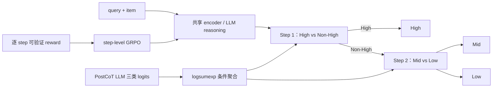

# CORE：级联序数相关性、step-GRPO 与 PostCoT 蒸馏

> **Fidelity: 核心机制复现**。实际执行 flat/cascade 分类、条件 step reward、group-normalized clipped GRPO 和 PostCoT logit 聚合蒸馏；缩小 encoder、数据和 LLM。

## 论文信息

| 项目 | 内容 |
| --- | --- |
| 论文链接 | [arXiv 2607.24417](https://arxiv.org/abs/2607.24417) |
| 公司/机构 | Meituan / Beijing Institute of Technology |
| 首次公开日期 | 2026-07-27（arXiv v1） |
| 原文开源代码 | 否：论文未提供官方/作者代码（核查日期：2026-07-28） |
| Adapter | `core-relevance` |
| 本地复现代码 | [`src/auto_research/reproductions/core_relevance/`](https://github.com/daiwk/auto-research/tree/main/src/auto_research/reproductions/core_relevance/) |

## 原始论文总结

### 背景与主要改动

电商相关性是有序的 High/Mid/Low，但 flat 三分类把三个边界视为对称。CORE 先判断 High vs. Non-High；只有第一步为 Non-High 时才判断 Mid vs. Low，使两个 head 分别专注严格实体/意图匹配和较软的替代性边界。

LLM 版本先用正确的结构化 reasoning trace 做 SFT，再把轨迹切成最终答案、High/Non-High、条件 Mid/Low、格式四组，为每个有效 step 计算可验证的 $\pm1$ reward 并分别做 group normalization。线上低延迟版本用双头 BERT，并把 PostCoT LLM 的三类 logits 映射到两个条件 head 做蒸馏。



### 核心公式

对同一输入采样 $G$ 条轨迹，step $k$ 的 reward 独立标准化：

$$
A_i^{(k)}=
\frac{r_i^{(k)}-\mu_k}{\sigma_k+\epsilon},
\qquad r_i^{(k)}\in\{-1,+1\},
$$

跳过的 Mid/Low step 不产生 reward 或梯度；有效 token 使用 clipped GRPO ratio，并加 reference KL。

PostCoT teacher 的三类 logits $\mathbf z=[z_H,z_M,z_L]^\top$ 映射为：

$$
\mathbf z_{\mathrm{LLM}}^{(1)}
=\left[\log(e^{z_M}+e^{z_L}),z_H\right]^\top,
\qquad
\mathbf z_{\mathrm{LLM}}^{(2)}=[z_L,z_M]^\top.
$$

student 同时优化条件 BCE 和温度为 $T$ 的两个 head KL/BCE 蒸馏项。

### 论文离线与线上效果

论文私有 9 万 query-item 集上，Direct-BERT accuracy `0.7441`，Cascaded-BERT `0.7558`，蒸馏后 `0.7622`；Direct-GRPO `0.7478`，Cascaded-GRPO `0.7541`，Cascaded-StepGRPO `0.7648`，PostCoT-CORE 达 `0.7706`。线上 Cascaded-BERT 相对 flat BERT 把 NDCG@5 从 `0.9020` 提到 `0.9038`（`+0.20%`），Badcase@5 从 `13.8%` 降到 `11.6%`（相对 `-15.9%`）。

## 本地复现

> **本地对照口径**：基线为 MovieLens-1M 构造的同一 Low/Mid/High query-item 集上的 flat 三分类；实验组为级联 SFT、step-GRPO teacher 和 PostCoT 蒸馏 student。最终 NDCG@5 相对基线 **+0.98%**、Badcase@5 **-50.00%**，accuracy 则低 **0.52 个百分点**。

| Variant | Accuracy | Macro-F1 | NDCG@5 | Badcase@5 |
| --- | ---: | ---: | ---: | ---: |
| Flat classifier | 0.5833 | 0.5640 | 0.9104 | 0.0625 |
| Cascaded classifier | 0.5781 | 0.5657 | 0.8986 | 0.0625 |
| Cascaded + step-GRPO | 0.5781 | 0.5649 | 0.9012 | 0.0625 |
| PostCoT distilled cascade | 0.5781 | 0.5672 | 0.9194 | 0.0313 |

step-GRPO 末段平均有效 step reward 为 `0.3811`。指标见 [`metrics/movielens-1m-ordinal-seed42.json`](metrics/movielens-1m-ordinal-seed42.json)。

```bash
auto-research reproduce --paper core-relevance --dataset-dir data --device mps --seed 42
```

## 复现边界

MovieLens 用户 genre 画像与候选 genre overlap 构造可审计的三级序数标签，替代美团私有 query-item 标注；小型 MLP 替代 Qwen3-14B 与生产 BERT。结果只验证级联、step credit 和 PostCoT 蒸馏链路，不能外推到搜索语义或线上阈值。
