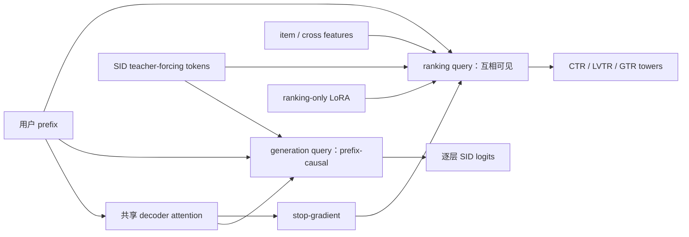

# UniR²：一个 decoder 同时完成生成召回与多目标排序

> **Fidelity: 核心机制复现**。实际训练层级 SID、Dual-Query Prefix-Causal Attention、ranking-only LoRA 和生成/排序联合目标；缩小 codebook、模型和业务标签。

## 论文信息

| 项目 | 内容 |
| --- | --- |
| 论文链接 | [arXiv 2607.24439](https://arxiv.org/abs/2607.24439) |
| 公司/机构 | Kuaishou / IIE, CAS / UCAS |
| 首次公开日期 | 2026-07-27（arXiv v1） |
| 原文开源代码 | 否：论文未提供官方/作者代码（核查日期：2026-07-28） |
| Adapter | `unir2` |
| 本地复现代码 | [`src/auto_research/reproductions/unir2/`](https://github.com/daiwk/auto-research/tree/main/src/auto_research/reproductions/unir2/) |

## 原始论文总结

### 背景与主要改动

传统工业 cascade 分别训练 recall 和 ranking：两边重复编码用户历史，生成轨迹在候选交接时丢失，训练目标也可能冲突。UniR² 把用户上下文、目标物品 SID 轨迹和 item ranking features 拼成一个 decoder-only 异构序列，让生成轨迹成为召回与排序之间的表示桥。

DQ-PCA 为同一层提供两种 query：generation query 只能读取完整用户 prefix 和此前 SID；ranking query 可读取压缩用户状态、完整 SID 轨迹和同步可见的 item tokens。基础 Q/K/V 共享，但 ranking 分支对共享输出 stop-gradient，只用 LoRA 学排序特有的交互，防止排序梯度破坏生成主干。



### 核心公式

层级 SID 生成：

$$
p_\theta(s_v\mid u)=\prod_{i=1}^{L}
p_\theta(q_i\mid u,q_{<i}).
$$

generation mask 允许第 $i$ 个 SID query 读取全部用户 prefix 和截至自身的 SID：

$$
M^{\mathrm{gen}}_{i,j}=
\begin{cases}
0,&j\le |\mathcal P|\ \text{或}\ |\mathcal P|<j\le|\mathcal P|+i,\\
-\infty,&j>|\mathcal P|+i.
\end{cases}
$$

ranking LoRA 的优化隔离为：

$$
\Delta W_X^{\mathrm{rank}}=B_X^{\mathrm{rank}}A_X^{\mathrm{rank}},
\qquad
X^{\mathrm{rank}}=\operatorname{sg}(WX)+\Delta W_X^{\mathrm{rank}}X,
\quad X\in\{Q,K,V\}.
$$

### 论文离线与线上效果

工业离线集上，UniR² 相对最佳 recall baseline 的 HR/MRR 提升 `+3.05%` 到 `+5.29%`；ranking AUC/UAUC 在 CTR、LVTR、GTR 上提升 `+0.16%` 到 `+1.45%`。线上实验于 2026 年 6 月运行两周、覆盖 `5%` 流量，同时替换 OneLive recall 与生产 pre-ranker：快手 App 播放量 `+1.177%`、关注率 `+0.655%`、点赞率 `+2.560%`；快手极速版送礼用户 `+0.717%`、送礼意愿 `+1.567%`、送礼金额 `+2.569%`。

## 本地复现

> **本地对照口径**：基线为同一 MovieLens-1M 数据、SID、训练 step 和 full-catalog 候选上的独立生成 recall + ranking cascade；实验组把二者放进 DQ-PCA 单序列并启用 stop-gradient/LoRA。SID code accuracy 相对基线 **+34.04%**，但 NDCG@10 **-13.19%**。

| Variant | SID code accuracy | Hit@10 | NDCG@10 | 参数量 |
| --- | ---: | ---: | ---: | ---: |
| 独立 cascade | 0.2203 | 0.0344 | 0.0143 | 51,116 |
| UniR² | 0.2953 | 0.0313 | 0.0124 | 41,274 |

本地结果说明共享异构序列明显改善了 SID 学习，但 40-d、130-step 设置下 ranking 尚未抵消独立 tower 的容量优势。完整指标见 [`metrics/movielens-1m-seed42.json`](metrics/movielens-1m-seed42.json)。

```bash
auto-research reproduce --paper unir2 --dataset-dir data --device mps --seed 42
```

## 复现边界

MovieLens next-item 与 genre-affinity 代理快手 click/long-view/gift；本地使用两级 16-way SID，而非三层 8129 codebook，也未运行 beam search、3×640 服务模型和流水线并行。因此这里验证的是 DQ-PCA 与优化隔离，不声称迁移论文线上业务收益。
