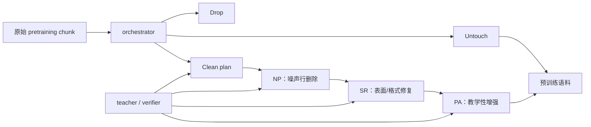

# DataOrchestra：逐样本编排预训练数据处理

> **Fidelity: 核心机制复现**。实际训练 per-example orchestrator、执行多操作路由并以同预算重新预训练；程序化教师和小模型替代论文大规模 LLM 工具链。

## 论文信息

| 项目 | 内容 |
| --- | --- |
| 论文链接 | [arXiv 2607.24717](https://arxiv.org/abs/2607.24717) |
| 公司/机构 | Fudan University / Shanghai Jiao Tong University / SII-GAIR |
| 首次公开日期 | 2026-07-27（arXiv v1） |
| 原文开源代码 | 是：[官方/作者代码](https://github.com/GAIR-NLP/DataOrchestra) |
| Adapter | `data-orchestra` |
| 本地复现代码 | [`src/auto_research/reproductions/data_orchestra/`](https://github.com/daiwk/auto-research/tree/main/src/auto_research/reproductions/data_orchestra/) |

## 原始论文总结

### 背景与主要改动

固定 corpus-level 清洗会过度处理本来干净的文本，也会对不同噪声使用同一操作。DataOrchestra 为每个 1024-token chunk 生成计划：先选 Drop、Untouch 或 Clean；Clean 时再按 NP（Noise Pruning）→ SR（Surface Rectification）→ PA（Pedagogical Augmentation）选择阶段，并为 rewrite 生成该 chunk 专属 instruction。

训练数据由强 teacher 先给粗计划，实际执行 tool model 后由 verifier 检查；失败 rewrite 最多纠正五次，内容损失或改动不足的 stage 被删除。通过验证的 `(chunk, evolved plan)` 用于 SFT 1.7B orchestrator。这样昂贵工具只处理确实需要的样本。



### 核心公式

orchestrator 学习每个样本的动作与条件 operation：

$$
p_\phi(\pi\mid x)
=p_\phi(a\mid x)
\prod_{j\in\{\mathrm{NP,SR,PA}\}}
p_\phi(o_j,I_j\mid x,a=\mathrm{Clean}),
$$

其中实际训练对序列化 JSON plan 做 teacher-forced SFT。处理后的语料 $\mathcal D_\phi$ 再用于标准 causal LM：

$$
\mathcal L_{\mathrm{LM}}(\theta;\mathcal D_\phi)
=-\sum_{x\in\mathcal D_\phi}\sum_t
\log p_\theta(x_t\mid x_{<t}).
$$

目标不是最大化清洗率，而是在下游质量与处理计算之间选择逐样本 Pareto 点；Drop/Untouch 会跳过不必要的 NP/SR/PA。

### 论文离线与线上效果

论文从头训练 0.5B、1.5B、7B 模型，并在 11 个 benchmark 上报告平均分。Raw→DataOrchestra 分别为 `37.63→39.99`、`39.87→42.44`、`44.79→47.66`，且超过 ProX 等单一处理基线；方法也泛化到 RedPajama-v2、DCLM-RefinedWeb、C4、FineWeb 与数学 continued pretraining。纯 LLM 预训练论文不适用工业线上 A/B 门槛。

## 本地复现

> **本地对照口径**：基线是在 WikiText-2 raw 文本上训练同一个 208,872 参数 Llama-style LM；实验组先用训练出的 orchestrator 逐块选择 Drop/Untouch/Clean 与四种本地 cleaning operation，再使用完全相同的 150k token、55 step、优化器和模型训练。DataOrchestra perplexity 相对 raw **变差 8.60%**，相对固定清洗则 **改善约 1.03%**。

| Variant | Final train loss | Test loss | Perplexity |
| --- | ---: | ---: | ---: |
| Raw | 6.0638 | 5.8861 | 359.985 |
| Static cleaner | 6.0248 | 5.9790 | 395.036 |
| DataOrchestra | 6.0590 | 5.9686 | 390.954 |

orchestrator 在 held-out 块上的 action/operation accuracy 为 `76.11%/84.78%`，实际路由到 normalize、repair、deduplicate、wiki 四种操作。负结果表明：WikiText-2 已较干净，程序化教师仍过度 Drop/Clean，论文的大规模异质 web corpus 收益不能直接迁移。完整指标见 [`metrics/wikitext-2-seed42.json`](metrics/wikitext-2-seed42.json)。

```bash
auto-research reproduce --paper data-orchestra --dataset-dir data --device mps --seed 42
```

## 复现边界

本地 8-feature MLP 与程序化规则替代 Qwen3-235B teacher/verifier、Qwen3-1.7B orchestrator、0.6B NP 和 4B SR/PA；四种确定性编辑替代自然语言 chunk-specific rewrite，WikiText-2 替代 20B/30B token 多语料。因此这是 orchestration 决策与下游预训练链路的核心机制复现，不是论文数据质量规模结论的复刻。
