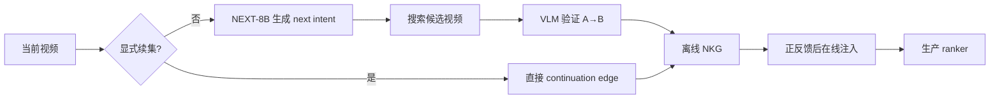
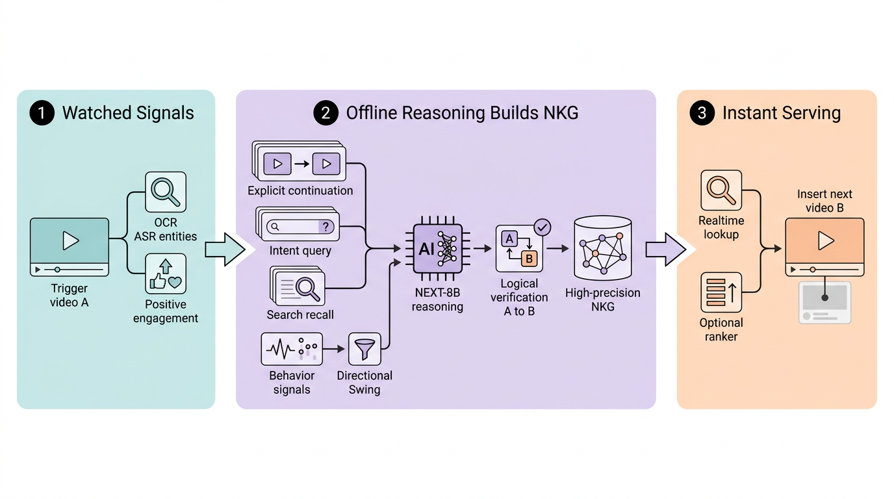

# NEXT：用视觉语言模型推理下一兴趣

> **Fidelity: 核心机制复现**。本地执行 item→intent→item、离线 directed edge 生成/验证和线上加性注入；没有把规则或 embedding 代理写成“训练了 NEXT-8B”。

## 论文信息

| 项目 | 内容 |
| --- | --- |
| 论文链接 | [arXiv 2607.24789](https://arxiv.org/abs/2607.24789) |
| 公司/机构 | Meta |
| 首次公开日期 | 2026-06-27（arXiv v1） |
| 原文开源代码 | 否：截至 2026-08-24 未发现原作者公开代码 |
| Adapter | `next-vlm` |
| 本地复现代码 | [`src/auto_research/reproductions/next_vlm/`](https://github.com/daiwk/auto-research/tree/main/src/auto_research/reproductions/next_vlm/) |

## 原始论文总结

### 背景与主要改动

共现和语义相似只能回答“哪些视频相近”，难以推断用户看完当前视频后下一步想做什么。NEXT 先识别显式续集；对隐式关系让 NEXT-8B VLM 生成 next-intent query，再检索并验证候选，形成 directed Next Knowledge Graph。推理放在离线，线上只在用户正反馈后注入高置信边，避免把 8B VLM 放进请求链路。



<!-- paper-figure:start -->
### 原论文关键图

[](https://arxiv.org/html/2607.24789v1/figures/next_system_strict_pro.png)

> **原论文 Figure 1（关键图）**：展示原论文提出的核心架构、主要模块及其连接关系。图片来自[原论文](https://arxiv.org/abs/2607.24789)，版权归原作者所有；点击图片可查看来源。
<!-- paper-figure:end -->

### 核心公式

训练分为感知增强 GRPO、分布对齐 SFT 和最后一公里偏好优化。离线边的抽象形式为

$$
q_A=\operatorname{VLM}_{intent}(A),\quad
B^*=\arg\max_{B\in\operatorname{Retrieve}(q_A)}
\operatorname{VLM}_{verify}(A,q_A,B).
$$

线上保持加性路径：

$$
\mathcal C(u,t)=\mathcal C_{prod}(u,t)\cup\operatorname{NKG}(v_t)
\quad\text{if positive engagement}(u,v_t).
$$

### 论文离线与线上效果

NEXT-8B 在 DocVQA 取得最佳单模型结果。约一亿用户、持续多周的生产 A/B 中，相对包含 HSTU 路径的强基线，watch time `+0.53%`、distinct video exposure `+0.51%`，负反馈、安全和延迟 guardrail 无显著退化。

## 本地复现

> **本地对照口径**：基线为同数据的 transition+semantic 多路径 ranker；实验组加入经语义验证的 directed NKG edges，NDCG@10 相对 `+20.33%`。

MovieLens-1M 单 seed 中，强 transition+semantic 基线 Hit@10/NDCG@10 为 `0.1750/0.0997`；加入验证后的 directed NKG edges 后为 `0.1917/0.1200`，相对 `+9.52%/+20.33%`，head share 从 `0.4146` 降至 `0.2150`。这是公开代理任务的单 seed 诊断结果，不是 Meta 线上收益复现。

```bash
auto-research reproduce --paper next-vlm --dataset-dir data --seed 42
```

稳定指标见 [`metrics/movielens-1m-seed42.json`](metrics/movielens-1m-seed42.json)。

## 复现边界

本地用电影标题/genre 和协同转移代理视觉语义与 VLM 验证；未训练 8B VLM、GRPO/SFT 偏好阶段，也没有短视频画面、私有安全模型和实时 serving。
