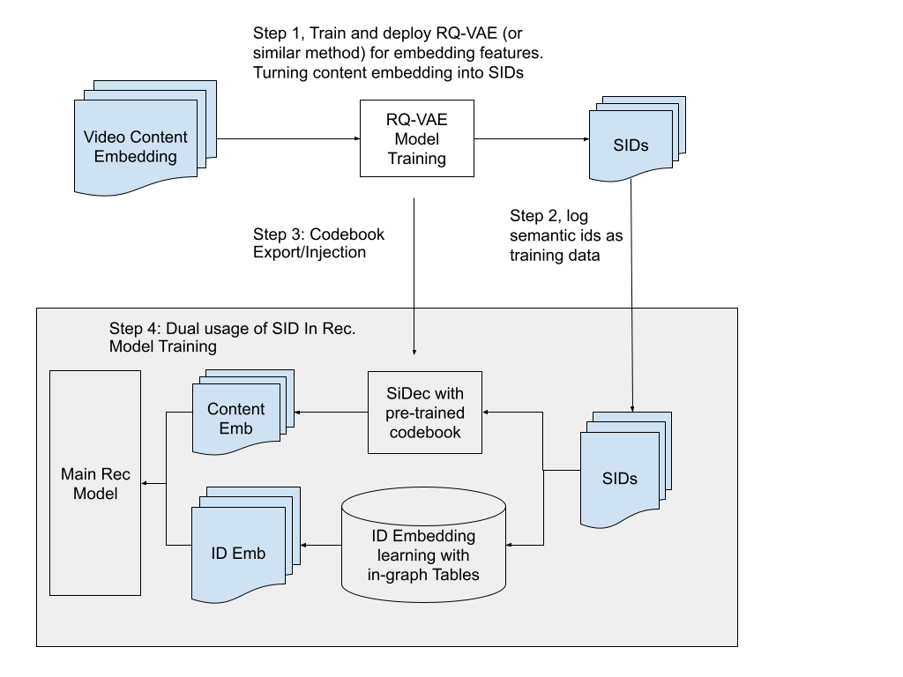

# Dual-purpose Semantic IDs：同时承载协同身份与内容语义

> **Fidelity: 核心机制复现**。本地训练分层 SID、SID 转移与 Semantic Decoder 内容重建，并用于检索评分。

## 论文信息

| 项目 | 内容 |
| --- | --- |
| 论文链接 | [arXiv 2607.24865](https://arxiv.org/abs/2607.24865) |
| 公司/机构 | Google DeepMind / YouTube |
| 首次公开日期 | 2026-07-26（arXiv v1） |
| 原文开源代码 | 否：论文未提供官方/作者代码（核查日期：2026-08-09） |
| Adapter | `dual-sid` |
| 本地复现代码 | [`src/auto_research/reproductions/dual_sid/`](https://github.com/daiwk/auto-research/tree/main/src/auto_research/reproductions/dual_sid/) |

## 原始论文总结

### 背景与主要改动

传统 SID 擅长表达协同身份，却仍需把大规模内容 embedding 输入推荐模型。论文以层次量化生成 SID，并加入 Semantic Decoder（SiDec）从 SID 重建内容表示，让同一串 token 同时支持生成式检索、排序和低 I/O 的在线 embedding reconstruction。


<!-- paper-figure:start -->
### 原论文关键图

[](https://arxiv.org/html/2607.24865v1#S3.F1)

> 原论文 Figure 1：SID 作为传递并重建语义 embedding 的通道。图片来自[原论文](https://arxiv.org/abs/2607.24865)，版权归原作者所有。
<!-- paper-figure:end -->

### 核心公式

设分层 code 为 $c(i)$，SiDec 参数为 $D$，训练同时优化协同目标和内容重建：

$$
\mathcal L=\mathcal L_{rec}+\lambda\left\|D\,[\operatorname{onehot}(c_1);\ldots;\operatorname{onehot}(c_L)]-v_i\right\|_2^2.
$$

### 论文离线与线上效果

- Watchpage ranking：sitewide `+0.09%`、watchpage `+0.80%`。
- Homepage ranking：sitewide `+0.08%`、homepage `+0.22%`。
- Retrieval：sitewide `+0.06%`、homepage `+0.13%`、watchpage `+0.09%`。

## 本地复现

> **本地对照口径**：基线为同切分的 dense transition-content retrieval，实验组加入 Dual-purpose SID 与 SiDec；NDCG@10 相对 `-12.40%`。

三层、每层 8 个 code 的 residual k-means SID；ridge SiDec 的内容重建 MSE 为 `0.006760`。与相同 dense retrieval 基线相比，Hit@10 `-8.33%`、NDCG@10 `-12.40%`、head share `-7.65%`。说明小 codebook 的 I/O 代理收益伴随明显质量损失。

指标见 [`metrics/movielens-100k-seed42.json`](metrics/movielens-100k-seed42.json)。

```bash
auto-research reproduce --paper dual-sid --dataset-dir data --seed 42
```

## 复现边界

genre 替代 YouTube 多模态内容；未复刻超大 codebook、线上 embedding reconstruction 和私有日志。
