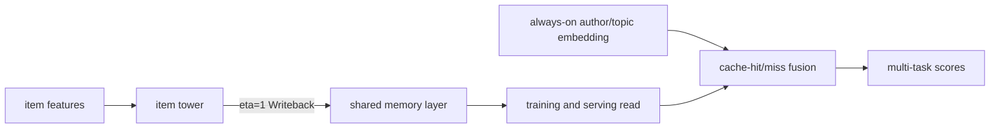
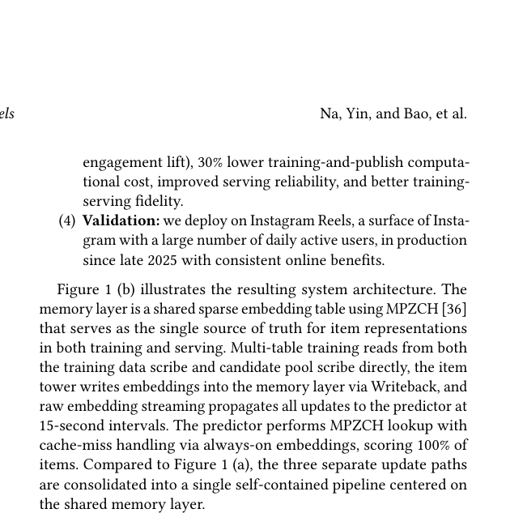

# Memory Layer：把推荐缓存纳入模型训练

> **Fidelity: 核心机制复现**。本地实现训练内 item-tower 写回、共享 cache 读取、冻结外部快照对照和 always-on cache-miss fallback；不把普通 embedding lookup 冒充 Meta 的 MPZCH 基础设施。

## 论文信息

| 项目 | 内容 |
| --- | --- |
| 论文链接 | [arXiv 2607.25110](https://arxiv.org/abs/2607.25110) |
| 公司/机构 | Meta / Instagram Reels |
| 首次公开日期 | 2026-07-27（arXiv v1） |
| 原文开源代码 | 是：[TorchRec](https://github.com/meta-pytorch/torchrec/) |
| Adapter | `memory-layer` |
| 本地复现代码 | [`src/auto_research/reproductions/memory_layer/`](https://github.com/daiwk/auto-research/tree/main/src/auto_research/reproductions/memory_layer/) |

## 原始论文总结

### 背景与主要改动

传统 early-stage ranker 在训练时用 item tower 的新鲜输出，服务时却读另一个流程预计算并发布的 item cache；cache miss 还会绕过正常模型。这造成训练、离线评测和线上服务看到三套不同表征。Memory Layer 把 cache 变成模型自身的稀疏参数表：item tower 在训练中写入，后续网络和服务共同读取；作者、topic 等 always-on 属性则保证新内容或 cache miss 仍可评分。



<!-- paper-figure:start -->
### 原论文关键图

[](https://arxiv.org/pdf/2607.25110#page=2)

> **原论文 Figure 1（关键图）**：展示原论文的整体流程、关键阶段及其数据流向。图片来自[原论文](https://arxiv.org/abs/2607.25110)，版权归原作者所有；点击图片可查看来源。
<!-- paper-figure:end -->

### 核心公式

训练样本中的 item $i$ 先产生 $e_i=f_{item}(x_i;\theta_t)$，再以学习率为 1 的写回更新共享表：

$$
M[i]\leftarrow e_i,\qquad \hat e_i=M[i].
$$

评分网络始终消费 $\hat e_i$；cache miss 时将该分量置零，并保留可泛化属性形成的 $a_i$：

$$
z_i=\operatorname{Fuse}(\hat e_i,a_i),\qquad \hat e_i=0\ \text{when miss}.
$$

TorchRec 与 FBGEMM 已包含 MPZCH、Writeback、RES 等基础组件；论文同时说明完整模型集成仍是 Meta 内部代码。

### 论文离线与线上效果

- Instagram Reels early-stage ranking 的预测覆盖率由 `96%` 提升到 `100%`，embedding freshness 从约 5 分钟缩短到约 20 秒。
- training-serving NE gap 在 pselect 上由 `12.11%` 降到 `1.64%`，相对缩小 `86%`。
- A/B backtest 中，一小时内媒体播放量 `+6%～+7%`，5 分钟内媒体超过 `2×`；reshare 与 time spent 均 `+5%～+6%`。
- 训练与发布计算成本降低 `30%`，服务计算成本保持中性。

## 本地复现

> **本地对照口径**：基线为同一 item tower 的外部冻结 cache（96% 容量、无 always-on miss 路径），实验组把写回纳入训练并对 100% item 提供 always-on 表征；seed 42 的 NDCG@10 相对基线约 `+4.36%`，结构诊断而非公开小数据 lift 是本复现重点。

本地按训练事件时间顺序执行一次 `eta=1` writeback，并记录 cache coverage、平均 staleness step 和写回误差。三 seed 产物：

- [`metrics/public-seeds42-44.json`](metrics/public-seeds42-44.json)：三随机种子逐次结果、均值、标准差与 95% CI。

```bash
auto-research reproduce --paper memory-layer --dataset-dir data --seed 42
```

## 复现边界

MovieLens 没有媒体创建时间、Instagram 冷启动曝光与线上 NE，因此不能验证论文业务 lift。本地没有复刻 MPZCH/FBGEMM 分布式存储、15 秒 raw embedding streaming、int8 row-wise quantization 或生产 cache 容量。
