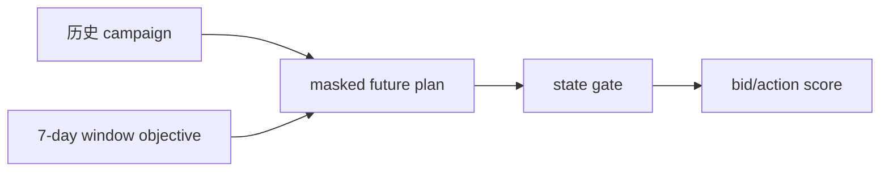
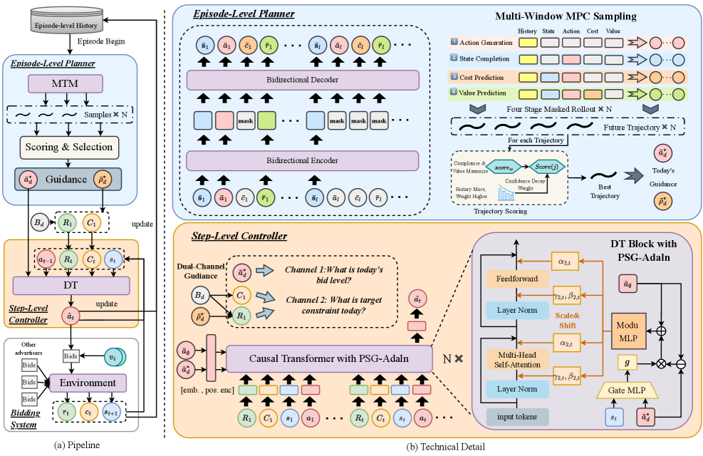

# SWAG：滑动窗口感知的生成式自动出价

> **Fidelity: 核心机制复现**。本地执行论文的窗口感知出价目标与约束代理，不把公开离线实验写成生产广告系统。

## 论文信息

| 项目 | 内容 |
| --- | --- |
| 论文链接 | [arXiv 2607.25233](https://arxiv.org/abs/2607.25233) |
| 公司/机构 | Alibaba International Digital Commerce / Dalian University of Technology |
| 首次公开日期 | 2026-07-28（arXiv v1） |
| 原文开源代码 | 否：论文未提供官方/作者代码（核查日期：2026-08-09） |
| Adapter | `swag-bid` |
| 本地复现代码 | [`src/auto_research/reproductions/swag_bid/`](https://github.com/daiwk/auto-research/tree/main/src/auto_research/reproductions/swag_bid/) |

## 原始论文总结

### 背景与主要改动

用 masked future plan 建模跨 episode 的七日滑窗目标，并以 per-step gate 将长期 guidance 注入当前 bid 决策。



<!-- paper-figure:start -->
### 原论文关键图

[](https://arxiv.org/html/2607.25233v1/x2.png)

> **原论文 Figure 2（关键图）**：展示原论文提出的核心架构、主要模块及其连接关系。图片来自[原论文](https://arxiv.org/abs/2607.25233)，版权归原作者所有；点击图片可查看来源。
<!-- paper-figure:end -->

### 核心公式

$$
a_t=\pi_\theta(s_t,\;g_t\odot h_{\mathrm{window}}),\quad g_t=\sigma(W[s_t;h_{\mathrm{window}}]).
$$

### 论文离线与线上效果

AliExpress 21 天 campaign-randomized A/B：cost +1.96%、GMV +3.42%、ROAS +5.65%、目标达成率 +2.02pp。

## 本地复现

> **本地对照口径**：基线为 single-episode Decision Transformer proxy，实验组为 sliding-window planner；同一小数据候选排序下 Hit@10 与 NDCG@10 均为 +0.00%。

把 MovieLens 周期行为映射为 campaign window，实际执行 future masking、七日 MPC score 和 state gate。

```bash
auto-research reproduce --paper swag-bid --data-root data --seed 42
```

稳定结果见 [`result-seed42.json`](metrics/result-seed42.json)。

## 复现边界

不是生产 Decision Transformer checkpoint，且公开数据没有 bid、budget、GMV，结果仅是结构消融。
