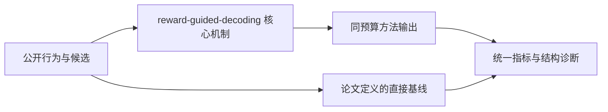
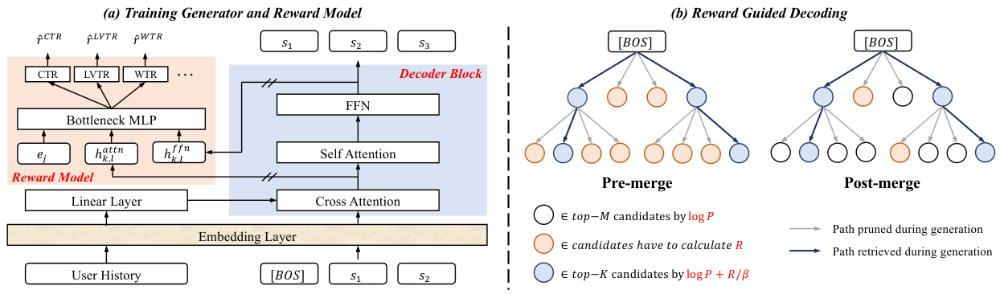

# Reward Guided Decoding：面向业务目标的生成式推荐解码

> **Fidelity: 核心机制复现**。本地代码执行论文最有辨识度、可由公开数据验证的机制；生产模型、私有日志与服务基础设施明确列为边界，不用普通基线冒充完整工业系统。

## 论文信息

| 项目 | 内容 |
| --- | --- |
| 论文链接 | [arXiv 2607.25344](https://arxiv.org/abs/2607.25344) |
| 公司/机构 | 中国科学院信息工程研究所（第一作者 Ruochen Yang） |
| 首次公开日期 | 2026-07-28（arXiv v1） |
| 原文开源代码 | 否：论文未提供官方/作者代码（核查日期：2026-09-01） |
| Adapter | `reward-guided-decoding` |
| 本地复现代码 | [`src/auto_research/reproductions/reward_guided_decoding/`](https://github.com/daiwk/auto-research/tree/main/src/auto_research/reproductions/reward_guided_decoding/) |

## 原始论文总结

### 背景与主要改动

保持生成器概率作为先验，在解码时用独立 reward 进行指数倾斜；闭式策略在提升期望 reward 的同时用 KL 温度限制偏离，无需重新训练生成器。



<!-- paper-figure:start -->
### 原论文关键图

[](https://arxiv.org/html/2607.25344v1/model.png)

> **原论文 Figure 2（关键图）**：展示原论文提出的核心架构、主要模块及其连接关系。图片来自[原论文](https://arxiv.org/abs/2607.25344)，版权归原作者所有；点击图片可查看来源。
<!-- paper-figure:end -->

### 核心公式

$$
Q^*(y\mid x)=\frac{P_0(y\mid x)\exp(R(x,y)/\beta)}{\sum_{y'}P_0(y'\mid x)\exp(R(x,y')/\beta)}.
$$

### 论文离线与线上效果

- 两周线上 A/B：页面 CTR +0.392%、watch time +0.689%、watch count +0.349%。
- 上述数字只复述论文线上证据，不写入本地公开数据的效果结论。

## 本地复现

> **本地对照口径**：基线按生成器似然解码，实验组用内容/新颖度 reward 做 KL 正则倾斜；seed 42 的 NDCG@10 为 `0.02249`，基线为 `0.05401`，负结果保留。相对线上业务 reward 的外推不适用。

三随机种子完整结果、均值、标准差与 95% CI：

- [`metrics/public-seeds42-44.json`](metrics/public-seeds42-44.json)

```bash
auto-research reproduce --paper reward-guided-decoding --dataset-dir data --seed 42
```

## 复现边界

本地使用公开 MovieLens 特征或由其构造的可审计代理任务，不能复现论文公司的私有用户日志、线上流量分配、生产模型规模和 serving 栈。因此本页只把本地结果解释为机制级验证；不将其外推为论文线上 lift，也不声称与原文绝对指标可直接比较。
