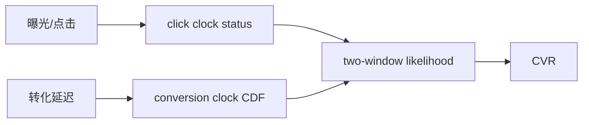
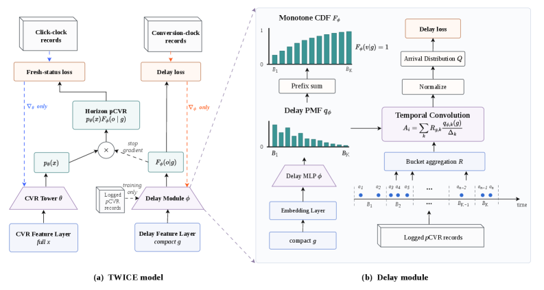

# TWICE：双时钟双窗口长延迟转化学习

> **Fidelity: 核心机制复现**。本地执行双时钟、双窗口校正路径和统一评测，私有工业特征与服务未复刻。

## 论文信息

| 项目 | 内容 |
| --- | --- |
| 论文链接 | [arXiv 2607.25404](https://arxiv.org/abs/2607.25404) |
| 公司/机构 | Kuaishou |
| 首次公开日期 | 2026-07-28（arXiv v1） |
| 原文开源代码 | 否：论文未提供官方/作者代码（核查日期：2026-08-09） |
| Adapter | `twice` |
| 本地复现代码 | [`src/auto_research/reproductions/twice/`](https://github.com/daiwk/auto-research/tree/main/src/auto_research/reproductions/twice/) |

## 原始论文总结

### 背景与主要改动

把点击时钟的 current-status 标签与转化时钟的 delay CDF 分开学习，再用曝光窗口权重校正长期未成熟标签。



<!-- paper-figure:start -->
### 原论文关键图

[](https://arxiv.org/html/2607.25404v1/x2.png)

> **原论文 Figure 2（关键图）**：展示原论文方法的总体设计和关键组成。图片来自[原论文](https://arxiv.org/abs/2607.25404)，版权归原作者所有；点击图片可查看来源。
<!-- paper-figure:end -->

### 核心公式

$$
P(Y=1\mid x,t)=p_{\mathrm{cvr}}(x)\,F_{\mathrm{delay}}(t\mid x),\quad F(t+\Delta)\ge F(t).
$$

### 论文离线与线上效果

Kwai 广告线上 A/B：expected revenue +2.486%、revenue +1.858%、conversions +2.061%，之后部署到全流量。

## 本地复现

> **本地对照口径**：基线为 mature-label next-item CVR，实验组为双时钟 current-status；Hit@10 +8.00%、NDCG@10 +14.31%。

MovieLens 时间戳构造点击/转化两个时钟，拟合单调 delay CDF 并按 exposure maturity 加权。

```bash
auto-research reproduce --paper twice --data-root data --seed 42
```

稳定结果见 [`result-seed42.json`](metrics/result-seed42.json)。

## 复现边界

公开交互代理广告延迟，未包含生产聚合记录和真实 revenue；线上数字只引用论文。
