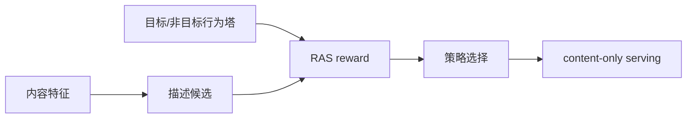
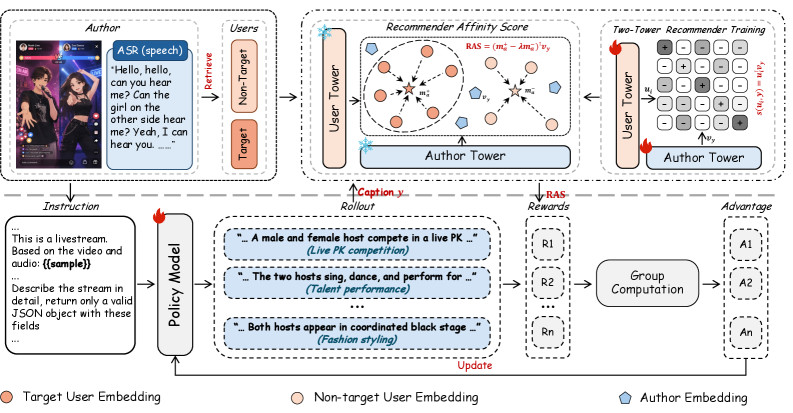

# RecoReward：用推荐器奖励训练多模态描述

## 论文信息

| 字段 | 内容 |
|---|---|
| 论文链接 | [arXiv 2607.25901](https://arxiv.org/abs/2607.25901) |
| 公司/机构 | Kuaishou / Nankai University / Chinese Academy of Sciences |
| 首次公开日期 | 2026-07-28（arXiv v1） |
| 原文开源代码 | 否：截至 2026-07-29 未发现官方公开仓库 |
| Adapter | `reco-reward` |
| 本地复现代码 | [`src/auto_research/reproductions/reco_reward/`](https://github.com/daiwk/auto-research/tree/main/src/auto_research/reproductions/reco_reward/) |

## 原始论文总结

### 背景与主要改动

冻结双塔推荐器，以目标用户与非目标用户的亲和力差作为奖励训练内容描述；线上 serving 只消费描述，不依赖用户画像。



<!-- paper-figure:start -->
### 原论文关键图

[](https://arxiv.org/html/2607.25901v1/x4.png)

> **原论文 Figure 4（关键图）**：展示原论文的整体流程、关键阶段及其数据流向。图片来自[原论文](https://arxiv.org/abs/2607.25901)，版权归原作者所有；点击图片可查看来源。
<!-- paper-figure:end -->

### 核心公式

$$
R_{\mathrm{RAS}}(d,u)=s(f(d),g(u))-\lambda\,\mathbb E_{u^-}s(f(d),g(u^-)).
$$

### 论文离线与线上效果

离线相对 Qwen 基线的 Recall 提升 31.7%–40.4%；快手一周 A/B 中关键页有效用户渗透 +0.265%、外流曝光 +0.791%、外流用户 +0.740%。

## 本地复现

> **本地对照口径**：基线为 content-only semantic recall，实验组为 RAS 选择；Hit@10 -16.00%、NDCG@10 -9.68%，head share -24.14%（负结果）。

MovieLens-100K 上以历史物品质心代理用户塔，执行目标/非目标扣减、620 个候选打分和 content-only serving。

```bash
auto-research reproduce --paper reco-reward --data-root data --seed 42
```

稳定结果见 [`result-seed42.json`](metrics/result-seed42.json)。

## 复现边界

没有微调 Qwen3.5-9B，也没有直播视频和快手私有行为；本地结果只验证 RAS 奖励可执行。
