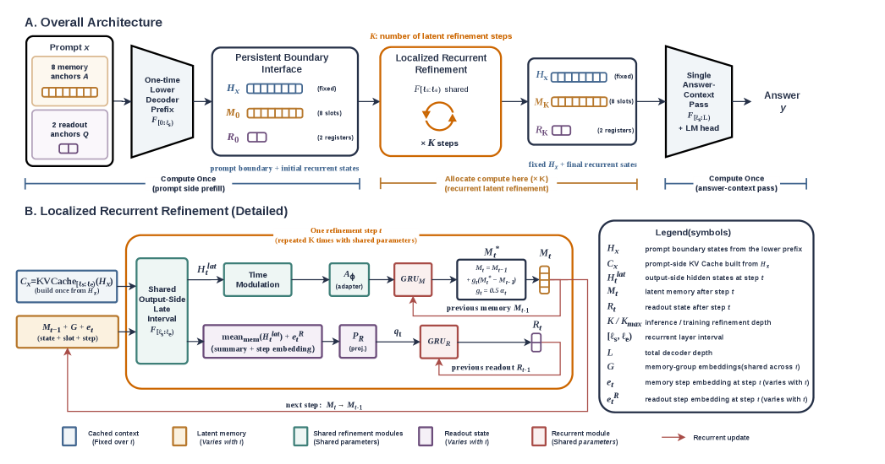

# Penelope：局部潜在递归的高效结构化推理

> **Fidelity: 核心机制复现**。本地执行局部潜在递归与门控状态更新；不复刻原论文的大模型训练规模。

## 论文信息

| 项目 | 内容 |
| --- | --- |
| 论文链接 | [arXiv 2607.25915](https://arxiv.org/abs/2607.25915) |
| 公司/机构 | Academic author team |
| 首次公开日期 | 2026-07-28（arXiv v1） |
| 原文开源代码 | 否：论文未提供官方/作者代码（核查日期：2026-08-09） |
| Adapter | `penelope` |
| 本地复现代码 | [`src/auto_research/reproductions/penelope/`](https://github.com/daiwk/auto-research/tree/main/src/auto_research/reproductions/penelope/) |

## 原始论文总结

### 背景与主要改动

只在一个 decoder 边界执行共享权重的 latent recurrence，用门控状态反复精炼表示，避免整条 decoder 重跑。


<!-- paper-figure:start -->
### 原论文关键图

[](https://arxiv.org/html/2607.25915v1/x1.png)

> **原论文 Figure 1（关键图）**：展示原论文方法的总体设计和关键组成。图片来自[原论文](https://arxiv.org/abs/2607.25915)，版权归原作者所有；点击图片可查看来源。
<!-- paper-figure:end -->

### 核心公式

$$
h^{k+1}=\operatorname{GRU}(h^k,F_\theta(h^k,t_k)),\quad k=1,\ldots,K.
$$

### 论文离线与线上效果

论文报告在结构化推理任务上以局部递归改善 accuracy/compute 权衡；未报告生产线上 A/B。

## 本地复现

> **本地对照口径**：基线为 llama_modern，实验组为 penelope；composite loss 从 6.9539 降到 6.9100，相对改善 0.63%。

WikiText-2 同预算 micro-LM 比较 modern decoder 与两步 localized recurrence，并记录实际参数、loss 与 perplexity。

```bash
auto-research reproduce --paper penelope --data-root data --seed 42
```

稳定结果见 [`result-seed42.json`](metrics/result-seed42.json)。

## 复现边界

12-step 本地预算不包含论文规模 checkpoint 和 CoT-to-latent curriculum，只验证真实 PyTorch 结构路径。
