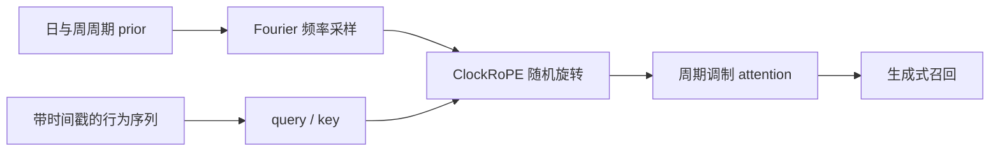
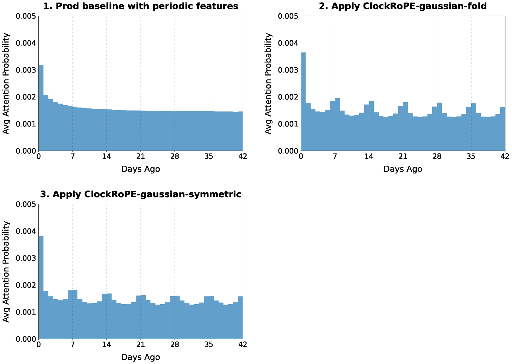

# ClockRoPE：用随机 Fourier 旋转建模用户周期性习惯

> **Fidelity: 核心机制复现**。本地执行周期 Gaussian Fourier kernel 对序列注意力的调制；公开数据缺少 YouTube 的小时级行为语境，因此结果只验证机制和边界。

## 论文信息

| 项目 | 内容 |
| --- | --- |
| 论文链接 | [arXiv 2607.26369](https://arxiv.org/abs/2607.26369) |
| 公司/机构 | YouTube / Google DeepMind |
| 首次公开日期 | 2026-07-29（arXiv v1） |
| 原文开源代码 | 否：截至 2026-08-24 未发现原作者公开代码 |
| Adapter | `clockrope` |
| 本地复现代码 | [`src/auto_research/reproductions/clockrope/`](https://github.com/daiwk/auto-research/tree/main/src/auto_research/reproductions/clockrope/) |

## 原始论文总结

### 背景与主要改动

普通 RoPE 的对数线性频率偏向“距离越远相关性越弱”，但推荐行为常有日周期和周周期。ClockRoPE 从目标周期 kernel 的 Fourier 变换中采样旋转频率，使 query-key 点积在相同小时或星期附近重新增强，并可与标准 RoPE 各占一半通道。



<!-- paper-figure:start -->
### 原论文关键图

[](https://arxiv.org/html/2607.26369v2/week.png)

> **原论文 Figure 3（关键图）**：展示原论文方法的总体设计和关键组成。图片来自[原论文](https://arxiv.org/abs/2607.26369)，版权归原作者所有；点击图片可查看来源。
<!-- paper-figure:end -->

### 核心公式

对正定 kernel $f$，随机 Fourier 旋转满足

$$
\mathbb E_{\xi\sim\tau}\left[(R_\xi(p_m)q_m)^\top(R_\xi(p_n)k_n)\right]
=q_m^\top k_n f(p_m-p_n).
$$

本地使用日/周周期 Gaussian：

$$
f_T(\Delta t)=\exp\{\kappa[\cos(2\pi\Delta t/T)-1]\},\quad T\in\{24,168\}.
$$

### 论文离线与线上效果

14 天线上 A/B 中，每个变体分配 1% 流量；RoPE+ClockRoPE 的 Engagement 和 Valued Engagement 均为 `+0.08%`。生产部署后 Valued Engagement Time `+0.08%`，TPU serving cost `-0.63%`，延迟中性。

## 本地复现

> **本地对照口径**：基线为不使用周期调制的 RoPE-style recency ranker；实验组加入日/周 ClockRoPE kernel，NDCG@10 相对 `-2.30%`。

MovieLens-100K 单 seed 机制实验中，RoPE-style 基线 Hit@10/NDCG@10 为 `0.1091/0.0540`，ClockRoPE 为 `0.1091/0.0528`，NDCG 相对 `-2.30%`。这是负结果：没有真实小时/星期 routine 时，周期先验不会自动带来收益。

```bash
auto-research reproduce --paper clockrope --dataset-dir data --seed 42
```

稳定指标见 [`metrics/movielens-100k-seed42.json`](metrics/movielens-100k-seed42.json)。

## 复现边界

公开 MovieLens 只提供稀疏评分时间，本地用确定性事件间隔构造周期位置；未复刻 YouTube 私有日志、生成式检索模型、TPU kernel 和线上 serving。
